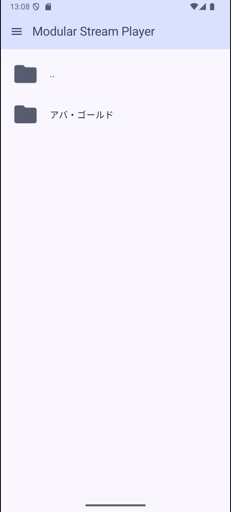
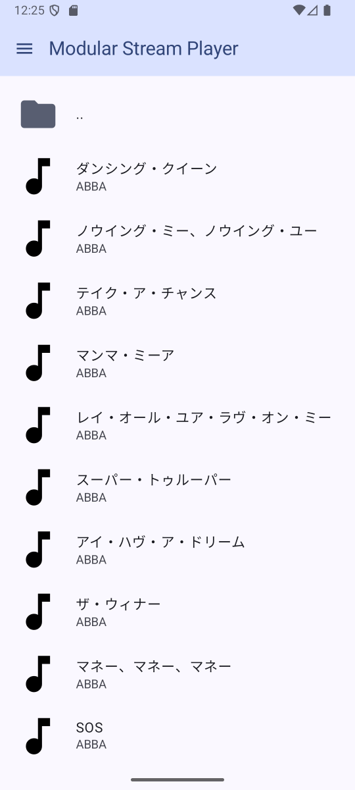
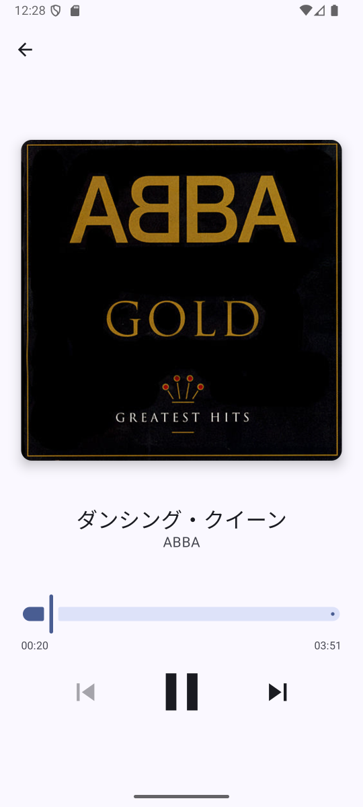
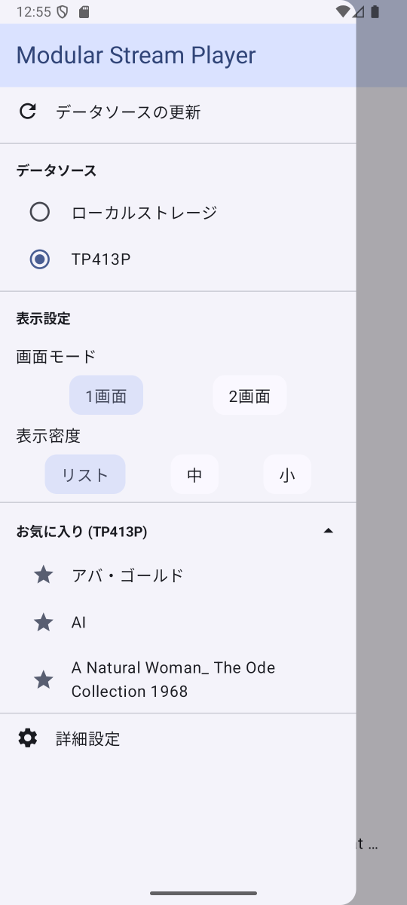
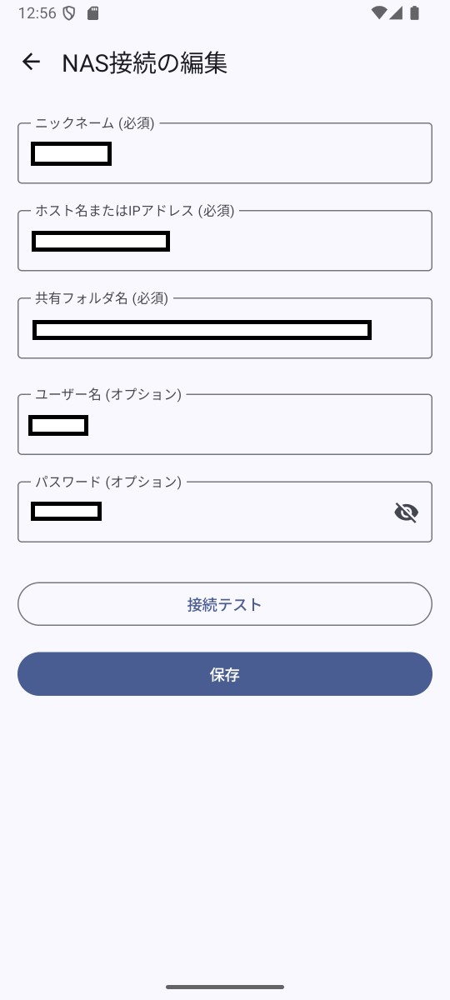

# Modular Stream Player

<!-- アプリのスクリーンショットやGIFをここに配置 -->
<p align="center">
  
</p>
<p align="center">
  
  
  
  
</p>

## 概要 (Overview)

Modular Stream Playerは、ローカルストレージおよび家庭内ネットワーク上のNAS (SMBプロトコル) に保存された音楽ライブラリを、快適に閲覧・ストリーミング再生できるAndroid向け音楽プレーヤーアプリです。

**コンセプト**: 複数の場所に散在する音楽ファイルの一元的な再生体験と、モダンな技術スタックによる開発の実現。
**開発期間**: 約1ヶ月 (Kotlin学習開始から)
**役割**: 企画・設計・開発・テストの全工程 (個人開発)
**GitHubリポジトリ**: [mob-wo/ModularStreamPlayer](https://github.com/mob-wo/ModularStreamPlayer)

## 特徴 (Features)

*   **マルチソース対応**:
    *   ローカルストレージの音楽ファイル
    *   NAS (SMB/CIFS共有) 上の音楽ファイル
*   **ファイルブラウジング**: 直感的なフォルダ/ファイルナビゲーション
*   **音楽再生**:
    *   ストリーミング再生 (ローカルファイル、SMB経由のファイル)
    *   バックグラウンド再生と通知領域でのコントロール
    *   再生/一時停止、曲情報表示
*   **NAS接続管理**:
    *   接続情報の追加・編集・削除
    *   EncryptedSharedPreferencesによる認証情報の安全な保存
    *   接続テスト機能
*   **UIカスタマイズ**:
    *   表示モード切替 (リスト形式 / 2列グリッド / 3列グリッド)
    *   画面レイアウト切替 (1画面モード / 2画面モード)
*   **お気に入りパス**: データソースごとのお気に入りフォルダ登録機能

## 技術的ハイライト (Technical Highlights)

本アプリは、個人開発でありながら将来的な機能拡張やチーム開発への移行も視野に入れ、以下の点に注力して設計・実装を行いました。

### 1. 大規模開発を見据えた設計と構成

*   **クリーンアーキテクチャ + MVVM**: UI、ドメイン、データレイヤーを分離し、関心事の分離とテスト容易性を追求。
    *   UI (Jetpack Compose) → ViewModel → Repository → DataSource の一方向データフロー。
*   **マルチモジュール構成**: 機能ごと、レイヤーごとにモジュールを分割 (`:app`, `:feature-*`, `:core-*`, `:data-*`, `:theme`)。
    *   依存関係を明確化し、ビルド時間の最適化とコードの再利用性を向上。
    *   各モジュールの責務は[こちら](#モジュール構成)で後述。
*   **DI (Hilt)**: 依存関係逆転の原則に基づき、クラス間の結合度を低減。テスト時のモック注入も容易に。
*   **`MediaSource` インターフェース**: データソース (`LocalMediaSource`, `SmbMediaSource`) を抽象化し、新たなデータソース追加（例: クラウドストレージ）への拡張性を担保。

### 2. Kotlinの特性を活かしたモダンな実装

*   **Kotlin Coroutines & Flow**: 非同期処理を構造化し、リアクティブなデータストリームを実現。
    *   `StateFlow` によるViewModelからUIへの状態通知。
    *   RepositoryやDataSourceからのデータ取得における`Flow`の活用。
    *   `Dispatchers` を用いた適切なスレッド管理。
*   **Jetpack Compose**: 100% Kotlinによる宣言的なUI構築。プレビュー機能による開発効率向上。
*   **拡張関数、データクラス、Sealed Class/Interface**: Kotlinの言語機能を活用し、コードの簡潔性と型安全性を向上。

### 3. SMB/ローカルHTTPサーバーというユニークな技術スタックへの挑戦

*   **SMBファイルストリーミング**:
    *   SMBプロトコルクライアントとして **JCIFS-NG** を採用。
    *   `MediaMetadataRetriever` や `ExoPlayer` が `smb://` URIを直接扱えない制約を回避するため、**NanoHTTPD** をベースとした **ローカルHTTPサーバー (`LocalHttpServer`)** をアプリ内に実装。
    *   `LocalHttpServer` がSMB上のファイルを読み取り、HTTPストリームとして `ExoPlayer` や `MediaMetadataRetriever` に中継することで再生とメタデータ抽出を実現。
*   **メタデータ抽出**:
    *   ローカルファイル: `ContentResolver` および `MediaStore`。
    *   SMBファイル: 上記 `LocalHttpServer` 経由で `MediaMetadataRetriever` を使用。

## 開発を通じて得られた知見・アピールポイント

*   **Kotlin習熟と短期間でのアプリ開発**: JavaやC#など他のオブジェクト指向言語での開発経験を活かし、Kotlinを学習開始から約1ヶ月という短期間で本規模のアプリケーションを設計・開発まで完遂。Kotlinのモダンな機能（Coroutines, Flow, Composeなど）を積極的に採用し、キャッチアップする高い学習能力と実践力を示しました。
*   **設計から実装までの一貫した経験**: 個人開発だからこそ、要件定義、技術選定、アーキテクチャ設計、UI/UXデザイン、実装、テストという開発の全工程を主体的に経験。特に、拡張性とメンテナンス性を考慮した設計原則（クリーンアーキテクチャ、モジュール化）を意識的に取り入れました。
*   **問題解決能力**: SMBストリーミングやメタデータ抽出といった、標準的なAndroid APIだけでは解決が難しい課題に対し、JCIFS-NGやNanoHTTPDといったライブラリを調査・組み合わせ、独自の解決策を実装。公式ドキュメントが少ない技術領域でも、試行錯誤とデバッグを繰り返して目標を達成しました。

## 苦労した点とそれを乗り越えた経験

*   **リアクティブプログラミングへのパラダイムシフト**:
    *   **課題**: 手続き型プログラミングの逐次的なコード実行に慣れていたため、Kotlin FlowやCoroutinesを用いた非同期処理や状態管理の概念を理解し、デバッグすることに当初苦労しました。特に、エラーハンドリングやライフサイクル管理が複雑に感じました。
    *   **解決策**: 公式ドキュメントの熟読、サンプルコードの分析に加え、小さな機能単位でFlowの動作を検証するプロトタイプを作成。`logcat`でのFlowのイベント追跡や、`ViewModel`内の状態変化を細かく監視することで、データの流れと副作用を理解。徐々にリアクティブな思考法に慣れ、状態変更の追跡やエラー伝播の設計ができるようになりました。
*   **複合的なマイナー技術領域での情報不足**:
    *   **課題**: SMB (JCIFS-NG)、ローカルHTTPサーバー (NanoHTTPD)、AndroidのメディアAPI (MediaMetadataRetriever, ExoPlayer) という複数の技術要素を組み合わせる際、それぞれの連携方法や最適な実装に関する情報が限られていました。特に、これらを協調させてSMB上のファイルのメタデータを効率的に取得し、かつ安定してストリーミング再生する部分では、AIによる支援も断片的で、最終的な解決には至りませんでした。
    *   **解決策**: 各ライブラリのGitHubリポジトリのIssueやサンプルコード、関連する海外の技術ブログ記事などを徹底的に調査。それぞれのライブラリの特性を理解した上で、独自のプロキシサーバー (`LocalHttpServer`) を介するアーキテクチャを考案・実装。多くの試行錯誤とデバッグ（ログ出力の強化、ステップ実行による変数監視など）を繰り返し、期待通りの動作を実現しました。この過程で、情報が少ない領域でも自力で問題を切り分け、解決策を模索する能力が鍛えられました。

## 技術スタック (Tech Stack)

*   **言語**: Kotlin
*   **UI**: Jetpack Compose
*   **アーキテクチャ**: クリーンアーキテクチャ, MVVM, マルチモジュール
*   **非同期**: Kotlin Coroutines, Flow (`StateFlow`, `SharedFlow`)
*   **DI**: Hilt
*   **メディア再生**: Jetpack Media3 (ExoPlayer, MediaSession, MediaLibraryService)
*   **画像読み込み**: Coil
*   **ネットワーク (SMB)**: JCIFS-NG (`eu.agno3.jcifs:jcifs-ng:2.1.7`)
*   **ローカルHTTPサーバー**: NanoHTTPD (`org.nanohttpd:nanohttpd-webserver:2.3.1`)
*   **データ永続化**:
    *   Jetpack DataStore (Preferences) - アプリ設定
    *   EncryptedSharedPreferences (Jetpack Security) - NAS認証情報
*   **シリアライズ**: kotlinx.serialization (NAS接続情報保存時)
*   **テスト**: JUnit (計画中), MockK (計画中), Turbine (計画中)

## システム構成・設計

### モジュール構成

本アプリは以下のモジュールで構成されています。

```+"`mermaid
graph TD
    subgraph "Presentation Layer (UI & ViewModel)"
        app
        feature_browser["feature-browser"]
        theme["theme"]
    end

    subgraph "Domain Layer (Core Logic & Models)"
        core_model["core-model"]
        core_player["core-player"]
    end

    subgraph "Data Layer (Repositories, DataSources, Network)"
        data_media_repository["data-media-repository (MediaRepository)"]
        data_repository["data-repository (Settings, Credentials etc.)"]
        data_source["data-source (MediaSource Interface)"]
        data_local["data-local (LocalMediaSource)"]
        data_smb["data-smb (SmbMediaSource)"]
        core_http["core-http (LocalHttpServer)"]
    end

    %% Application Layer Dependencies
    app --> feature_browser
    app --> theme
    app --> core_player %% PlaybackServiceの起動等
    app --> core_http %% LocalHttpServerの起動等

    %% Feature Layer Dependencies
    feature_browser --> core_model
    feature_browser --> data_media_repository
    feature_browser --> data_repository
    feature_browser --> core_player %% MediaController経由
    feature_browser --> core_http   %% PlayerViewModelがLocalHttpServerを利用
    feature_browser --> theme
    feature_browser --> data_smb %% ViewModelでSmbExceptionをハンドルするため

    %% Domain Layer Dependencies
    core_player --> core_model

    %% Data Layer Dependencies
    data_media_repository --> core_model
    data_media_repository --> data_source
    data_media_repository --> data_local
    data_media_repository --> data_smb
    data_media_repository --> data_repository %% SettingsRepository, NasCredentialsRepository
    data_media_repository --> core_http       %% SmbMediaSourceFactoryがLocalHttpServerを必要とするため

    data_smb --> core_model
    data_smb --> data_source
    data_smb --> core_http

    data_local --> core_model
    data_local --> data_source

    core_http --> core_model
    core_http --> data_repository %% LocalHttpServerがNasCredentialsRepositoryを利用

    data_repository --> core_model
    data_source --> core_model

"+"`"+`
```

### 主要シーケンス (例: NAS上の音楽再生)
```+"`mermaid
sequenceDiagram
    participant User
    participant BrowserScreen
    participant BrowserViewModel
    participant PlaybackRequestRepository
    participant PlayerViewModel
    participant LocalHttpServer
    participant MediaController
    participant PlaybackService (ExoPlayer)
    participant SmbMediaSource (via JCIFS-NG)

    User->>BrowserScreen: Tap TrackItem (SMB)
    BrowserScreen->>BrowserViewModel: onBrowserEvent(OnTrackClicked)
    BrowserViewModel->>PlaybackRequestRepository: requestPlayback(PlaybackRequest for SMB)
    PlaybackRequestRepository-->>PlayerViewModel: playbackRequest Flow emits
    PlayerViewModel->>PlayerViewModel: Process SMB PlaybackRequest
    PlayerViewModel->>LocalHttpServer: getStreamingUrl(smbPath, connectionId)
    LocalHttpServer-->>PlayerViewModel: Returns HTTP URL (e.g., http://127.0.0.1:8080/stream/...)
    PlayerViewModel->>MediaController: setMediaItem(HTTP_URL), prepare(), play()
    MediaController->>PlaybackService: (Commands forwarded)
    PlaybackService->>PlaybackService: ExoPlayer starts playing HTTP URL
    PlaybackService->>LocalHttpServer: HTTP GET Request for media stream
    LocalHttpServer->>SmbMediaSource: (Internally) Access SMB file using NasConnection
    SmbMediaSource->>SmbMediaSource: Stream file content via JCIFS-NG
    SmbMediaSource-->>LocalHttpServer: InputStream of SMB file
    LocalHttpServer-->>PlaybackService: HTTP Response with media stream

"+"`"+`
```

詳細な設計ドキュメントはリポジトリ内で公開しています。
- [技術設計書 - Overview](docs/Technical%20Design%20Document%20-%20Overview.md)
- [技術設計書 - Phase1](docs/Technical%20Design%20Document%20-%20Phase1.md)
- [技術設計書 - Phase2](docs/Technical%20Design%20Document%20-%20Phase2.md)
- [技術設計書 - Phase3](docs/Technical%20Design%20Document%20-%20Phase3.md)
- [要件定義書](docs/REQUIREMENTS.md)

## 今後の展望 (Future Enhancements)

*   FLACなど他の音声フォーマット対応
*   プレイリスト機能の強化
*   メタデータ編集機能
*   クラウドストレージ連携 (Google Drive, Dropboxなど)
*   単体テスト・UIテストのカバレッジ向上

## 貢献 (Contributing)

現在、個人開発プロジェクトですが、フィードバックや改善提案は歓迎します。IssueやPull Requestをお気軽にどうぞ。

## ライセンス (License)

[Apache License 2.0](LICENSE)
