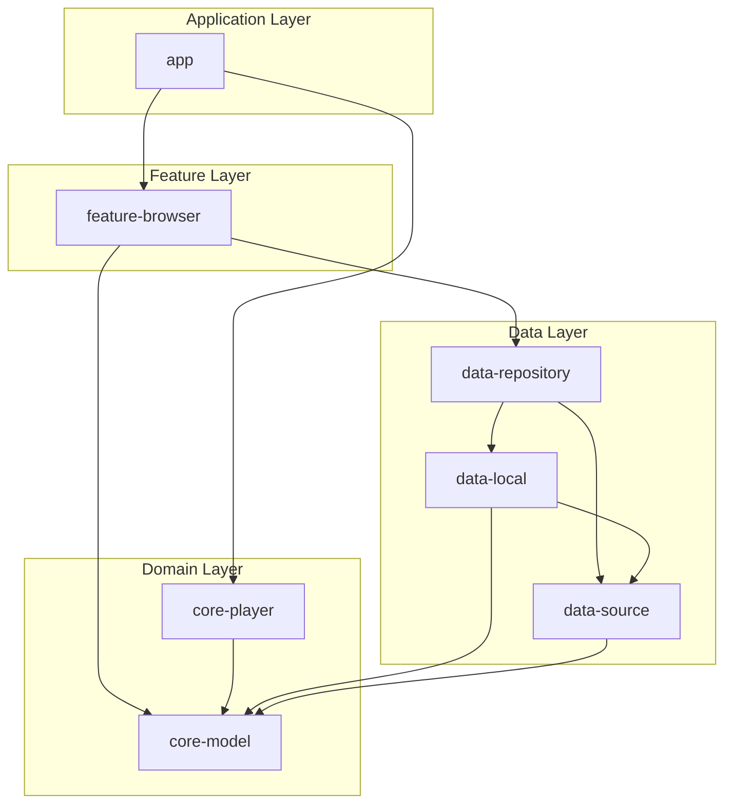
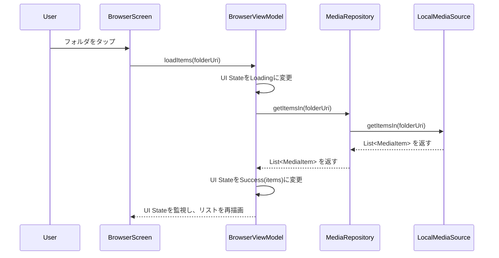
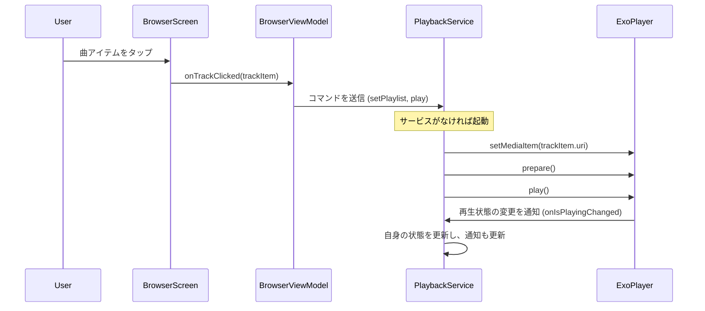

# Androidアプリ「Modular Stream Player」要件定義書 (統合版 v3.0)

## 0. プロジェクト概要

### 0.1. 目的
本プロジェクトは、ローカルストレージおよび家庭内NAS(SMB)に保存された音楽ファイルを、Androidデバイス上で快適に閲覧・ストリーミング再生できる、拡張性とメンテナンス性に優れた音楽プレーヤーアプリを開発することを目的とする。

### 0.2. 開発思想
1.  **アジャイル**: 小さな機能単位でスプリントを回し、動くソフトウェアを継続的にリリースする。
2.  **拡張性**: メディアソース（ローカル, SMB等）やメディア形式（MP3, FLAC等）を容易に追加できるよう、インターフェースベースの疎結合な設計を徹底する。
3.  **テスト駆動**: すべてのビジネスロジックは単体テスト可能でなければならない。UIからロジックを分離し、テスト容易性を確保する。
4.  **モジュール化**: 機能ごとにモジュールを分割し、依存関係を明確化する。

---

## 1. 提案アジャイル開発フェーズ (スプリント計画)

開発は以下のフェーズ順に進めることを推奨する。

-   **フェーズ1: ローカルファイラー基盤構築 (Sprint 1-2)**
    -   **ゴール**: ローカルストレージ内の音楽ファイルを閲覧・再生できる最低限のファイラーアプリを完成させる。
    -   対象要件: `A-01`, `A-02`, `A-04`, `F-06`, `F-07`, `F-09`, `F-11`, `F-12`, `F-16`, `F-17`, `F-18`

-   **フェーズ2: UI/UX向上とナビゲーション強化 (Sprint 3-4)**
    -   **ゴール**: ドロワーナビゲーション、パス管理機能を追加し、音楽プレーヤーとしての使い勝手を向上させる。
    -   対象要件: `F-10(改訂)`, `F-13(改訂)`, `F-19`, `F-20(改訂)`, `F-21(改訂)`, `F-22`, `F-23`, `F-24`, `F-25`, `F-26`, `F-27`, `F-28`, `F-29`

-   **フェーズ3: SMB対応 (Sprint 5-6)**
    -   **ゴール**: メディアソースとしてNAS(SMB)を追加する。
    -   対象要件: `F-01`, `F-02`, `F-03`, `F-04`, `A-03`

-   **フェーズ4: プレーヤー機能拡充 (Sprint 7以降)**
    -   **ゴール**: プレーヤーとしての追加機能や品質向上を図る。
    -   対象要件: `F-14`

---

## 2. アプリケーションアーキテクチャと技術スタック

-   **アーキテクチャ**: クリーンアーキテクチャを参考にしたマルチモジュール構成（app, core-*, feature-*, data-*）
-   **言語**: Kotlin
-   **UI**: Jetpack Compose
-   **非同期処理**: Kotlin Coroutines (Flow)
-   **DI**: Hilt
-   **メディアプレーヤー**: Jetpack Media3 (ExoPlayer, MediaSession)
-   **画像読み込み**: Coil (カスタムFetcherによる拡張を含む)
-   **SMBクライアント**: JCIFS-NG
-   **ローカルHTTPサーバー**: NanoHTTPD
-   **ID3タグ解析**: mp3agic
-   **認証情報保存**: Jetpack Security (EncryptedSharedPreferences), Jetpack DataStore
-   **テスト**: JUnit5, MockK, Turbine, Espresso (for UI Test)

---

## 3. 機能要件 (Functional Requirements)

### 3.1. データソース・抽象化 (Architecture)
-   `A-01`: メディアソース（ファイル置き場）を抽象化する`MediaSource`インターフェースを定義する。このインターフェースは、アイテムリストの取得、再生用URIの取得、アートワークデータの取得メソッドを持つ。
-   `A-02`: ローカルストレージ用の`LocalMediaSource`クラスを実装する。
-   `A-03`: SMB用の`SmbMediaSource`クラスを実装する。
-   `A-04`: ViewModelは具象クラスを直接参照せず、DIによって注入された`MediaSource`インターフェースを通じてデータにアクセスする。

### 3.2. NAS(SMB)接続設定 (Feature)
-   `F-01`: ユーザーはNASに接続するための情報（IPアドレス/ホスト名, 共有フォルダ名, ユーザー名, パスワード）をアプリに入力・保存できる。（**Note**: 本設定は「詳細設定」画面にて行う）
-   `F-02`: 保存された接続情報は、`EncryptedSharedPreferences`を用いて安全に保管される。
-   `F-03`: アプリは保存された情報を用いて、接続を試みることができる。
-   `F-04`: ユーザーは保存した接続情報を編集・削除できる。

### 3.3. ファイルブラウズ (Feature)
-   `F-05`: メディアソース（ローカルまたはSMB）に接続後、ファイルとサブフォルダの一覧をリスト形式で表示する。
-   `F-06`: フォルダをタップすると、そのフォルダ内に移動（ドリルダウン）できる。
-   `F-07`: 親フォルダへ戻るナビゲーション機能を提供する。
-   `F-08`: MP3拡張子を持つファイルとフォルダのみを表示対象とする。
-   `F-19`: リストの各行には、以下の情報を表示する。
    -   **ファイル**: ID3タグから抽出した**アートワーク**、**曲名**、**アーティスト名**を表示。情報がない場合はデフォルトアイコンとファイル名で代替する。
    -   **フォルダ**: 固定のフォルダアイコンとフォルダ名を表示する。
-   `F-20(改訂)`: **ナビゲーションドロワー内の設定**で、リストの表示密度を「**大 (リスト)**」「**中 (2列グリッド)**」「**小 (3列グリッド)**」に切り替えできる。
-   `F-21(改訂)`: **ナビゲーションドロワー内の設定**で、画面レイアウトを「**1画面モード（全画面ブラウザ）**」と「**2画面モード（ブラウザ＋ミニプレーヤー）**」に切り替えできる。

### 3.4. 音楽再生 (Feature)
-   `F-09`: MP3ファイルをタップすると、ストリーミング再生が開始される。
-   `F-10(改訂)`: 再生画面には、現在再生中の曲の**アートワーク**、**曲名**、**アーティスト名**を大きく表示する。
-   `F-11`: 再生/一時停止コントロールを提供する。
-   `F-12`: 再生位置を示す**シークバー**を表示し、ユーザーによるシーク操作を可能にする。
-   `F-13(改訂)`: **次へ/前へ**の曲移動コントロールを提供する（同一フォルダ内）。再生曲が変更された際、ファイルブラウザ画面に表示されている場合は、対応するアイテムにフォーカス（選択状態など）を移動させる。
-   `F-14`: **リピート再生（1曲/全曲）**および**シャッフル再生**機能を提供する。

### 3.5. バックグラウンド再生 (Feature)
-   `F-16`: アプリがバックグラウンドに移行しても音楽再生は継続される（`Foreground Service`を使用）。
-   `F-17`: 再生中は、Androidの通知領域に再生コントロールパネル（アートワーク、曲名、再生/一時停止/次へ/前へ）を表示する。
-   `F-18`: 通知パネルからアプリを完全に終了させるための停止ボタンを提供する。

### 3.6. ナビゲーションと設定 (Feature)
-   `F-22`: アプリは主要なナビゲーション機能を提供するナビゲーションドロワーを持つ。
-   `F-23`: ドロワーから現在利用可能なデータソース（ローカル、保存済みNAS）を切り替えることができる。
-   `F-24`: ドロワー内に、現在選択中のデータソースのコンテンツを最新の状態に更新するための「更新」ボタンを配置する。
-   `F-25`: ドロワー内に、各データソースに紐づく「お気に入りパス」のリストを表示する。このリストは展開・非表示を切り替えられる。
-   `F-26`: ファイルブラウザ画面でフォルダアイテムを長押しすると、そのフォルダを「お気に入りパス」に追加できる。
    -   `F-26-1`: 追加が成功した旨を通知（ToastやSnackbarなど）でユーザーに知らせる。
    -   `F-26-2`: 既にお気に入りに追加されているパスを追加しようとした場合、追加は行わず、その旨を通知する。
-   `F-27`: ドロワー画面でお気に入りパスの項目を長押しすると、確認ダイアログを表示した後、そのパスをお気に入りから削除できる。
    -   `F-27-1`: 削除処理の結果（成功/失敗）を通知でユーザーに知らせる。
-   `F-28`: 各データソースには、デフォルトパスを設定できる。アプリ起動時やデータソース切り替え時には、このデフォルトパスが最初に表示される。
    -   `F-28-1`: ローカルストレージのデフォルトパスの初期値は `/storage/emulated/0/Music` とする。
-   `F-29`: ドロワーから「詳細設定」画面に遷移できる。この画面では、NASの接続情報や各データソースのデフォルトパスなど、変更頻度の低い項目を設定・編集できる。

---

## 4. 非機能要件 (Non-Functional Requirements)

### 4.1. パフォーマンス
-   `NF-01`: MP3ファイルタップ後、5秒以内に再生が開始されること（Wi-Fi環境に依存）。
-   `NF-02`: 安定したネットワーク環境において、音飛びや意図しない停止が発生しないよう、適切なバッファリングを行うこと。
-   `NF-07`: ファイルブラウザのスクロールは、アートワークの非同期読み込みによってカクつかないこと（Coilのキャッシュ活用）。

### 4.2. ユーザビリティ
-   `NF-03`: 直感的に操作できるシンプルなUIを提供する。
-   `NF-04`: エラーハンドリングを丁寧に行う（例: 接続失敗、ファイルアクセス不可等の場合に、ユーザーフレンドリーなメッセージを表示）。
-   `NF-08`: レイアウト設定（表示密度、画面モード）はアプリ終了後も維持されること。

### 4.3. セキュリティ
-   `NF-05`: NASの接続情報（特にパスワード）は、暗号化して保存する。

### 4.4. 互換性
-   `NF-06`: 対応Androidバージョンは、APIレベル 26 (Android 8.0 Oreo) 以上とする。

### 4.5. テスト容易性
-   `A-05`: ViewModelやRepositoryなどのビジネスロジックは、JUnitとMockK/Turbineを用いて単体テストを作成する。
-   `A-06`: UIから独立したロジックのテストを容易にするため、テストダブル（Fake/Stub）を活用する。
-   `A-07`: 各モジュールには、対応するテストコードを配置する`test`および`androidTest`ソースセットを必ず作成する。
    --- START OF FILE Technical Design Document-Phase1.md ---
## **技術設計書: Modular Stream Player (v1.0) - 改訂版**

### 1. アーキテクチャとモジュール構造

**1.1. 全体アーキテクチャ**
*   **クリーンアーキテクチャ**を参考にした、関心事の分離を徹底したマルチモジュール構成を採用する。
*   依存性のルールを徹底し、内側のレイヤー（`core-model`, `data-source`）は外側のレイヤーを知らない。**依存の方向は常に内側に向かう。**
*   **UI → ViewModel → Repository → DataSource** という一方向のデータフローを基本とする。
*   依存性の注入（DI）には **Hilt** を使用し、各レイヤー間の依存関係を疎結合に保つ。

**1.2. モジュール構成図（フェーズ1時点）**

循環参照を解消し、依存関係を明確にするため`data-repository`モジュールを追加しました。



*   **:app**: MainActivity, DIコンテナの初期化, Navigation Graphの定義。
*   **:feature-browser**: `BrowserScreen`, `PlayerScreen`のUIと`BrowserViewModel`, `PlayerViewModel`。`MediaRepository`を利用する。
*   **:core-player**: `PlaybackService` (Foreground Service), ExoPlayerの管理, 通知コントロール。
*   **:core-model**: アプリ共通のデータクラス (`MediaItem`, `PlaybackState`など)。どのモジュールからも依存されない、最も内側のレイヤー。
*   **:data-repository**: データ層へのアクセス窓口である`MediaRepository`の実装。`data-source`と`data-local`に依存。
*   **:data-source**: `MediaSource`インターフェースの定義。データソースの「契約」を定義する。
*   **:data-local**: `LocalMediaSource`の実装。ローカルストレージからのデータ取得ロジックを持つ。`data-source`のインターフェースを実装する。

---

### 2. 主要インターフェースとデータクラス定義

コーディングの「契約」となる部分を定義します。

#### **2.1. `:core-model`**

```kotlin
// MediaItem.kt
sealed interface MediaItem {
    val name: String
    val path: String
    val uri: String // 再生や識別に使うURI形式のID
}

data class FolderItem(
    override val name: String,
    override val path: String,
    override val uri: String
) : MediaItem

data class TrackItem(
    override val name: String,
    override val path: String,
    override val uri: String,
    val artist: String?,
    val album: String?,
    val artworkUri: String?, // Coilで読み込む用のアートワークURI
    val durationMs: Long
) : MediaItem
```

#### **2.2. `:data-source`**

データソースのインターフェース（契約）を定義します。

```kotlin
// MediaSource.kt
interface MediaSource {
    /** 指定されたパス（フォルダURI）直下のアイテムリストを取得する */
    suspend fun getItemsIn(folderUri: String?): List<MediaItem>

    // (フェーズ3以降) Coilでアートワークを読み込むためのカスタムFetcherを登録するメソッド
    // fun registerCoilExtensions(coilRegistry: ImageLoader.Builder)
}
```

#### **2.3. `:data-repository`**

ViewModelが利用するリポジトリを定義します。

```kotlin
// MediaRepository.kt
class MediaRepository @Inject constructor(
    private val localMediaSource: MediaSource // DIでインターフェースを注入
) {
    suspend fun getItemsIn(folderUri: String?): List<MediaItem> {
        // 現状はローカルのみだが、将来的にはここでメディアソースを切り替える
        // 例: if (isSmb) smbMediaSource.getItemsIn() else localMediaSource.getItemsIn()
        return localMediaSource.getItemsIn(folderUri)
    }
}
```
*Note: Hiltの`@Binds`を用いて、`MediaSource`インターフェースに`LocalMediaSource`実装を束縛する設定が別途必要です。*

---

### 3. 主要機能のシーケンス設計

#### **3.1. ファイルリスト表示シーケンス**

ユーザーがフォルダをタップしてからリストが更新されるまでの流れ。



#### **3.2. 音楽再生開始シーケンス (最重要)**

ユーザーが曲をタップしてから再生が開始されるまでの流れ。UIとバックグラウンドサービスが連携する。



---

### 4. 実装詳細と技術選定理由

#### **4.1. バックグラウンド再生 (`:core-player`)**
*   **`PlaybackService`**: `MediaLibraryService` (from Jetpack Media3) を継承して実装する。
    *   これにより、`MediaSession`のライフサイクル管理、通知の自動生成、他のメディアアプリ（Googleアシスタント等）との連携が大幅に簡略化される。
*   **`ExoPlayer`インスタンス**: `PlaybackService` 内でシングルトンとして管理する。
*   **UIとの通信**:
    *   **UI → Service**: `MediaController` (from Jetpack Media3) を使って再生/停止などのコマンドを送信する。
    *   **Service → UI**: `MediaController.Listener` を通じて、再生状態のコールバックを受け取り、ViewModelの`StateFlow`を更新する。

#### **4.2. ローカルメディアアクセス (`:data-local`)**
*   **権限**: `READ_MEDIA_AUDIO` (Android 13以上) または `READ_EXTERNAL_STORAGE` (それ以前) の権限が必要。
*   **データ取得**: `ContentResolver` と `MediaStore` API を使用して、デバイス上のオーディオファイル情報を効率的にクエリする。
    *   **Projection**: `MediaStore.Audio.Media._ID`, `DISPLAY_NAME`, `ARTIST`, `ALBUM`, `DURATION`などを指定して必要なカラムのみ取得する。
    *   `ContentUris.withAppendedId(MediaStore.Audio.Media.EXTERNAL_CONTENT_URI, id)` で各トラックのURIを生成する。これが `TrackItem.uri` となる。
*   **実装クラス**: `LocalMediaSource`クラスがこのロジックを担当する。

#### **4.3. アートワーク表示 (`:data-local` と Coilの連携)**
*   **課題**: `MediaStore`から直接アートワークのBitmapを取得するのは重い。URIで扱うのがモダンな方法。
*   **解決策**:
    1.  `TrackItem.artworkUri` には、アルバムIDから生成したアートワーク用のURI（例: `content://media/external/audio/albumart/{album_id}`）を格納する。
    2.  Coilは標準で `ContentResolver` を使った `content://` URIの読み込みをサポートしているため、特別な拡張なしで非同期読み込みが可能。
    ```kotlin
    // in BrowserScreen.kt
    AsyncImage(
        model = trackItem.artworkUri,
        contentDescription = "Album Art",
        placeholder = painterResource(id = R.drawable.ic_default_music_art)
    )
    ```

---

### 5. テスト戦略

*   **単体テスト (Unit Test)**:
    *   **対象**: ViewModel, Repositoryなど、Androidフレームワークに依存しないロジック。
    *   **ツール**: `JUnit5`, `MockK` (Mocking), `Turbine` (Flowのテスト)。
*   **インテグレーションテスト (Instrumentation Test)**:
    *   **対象**: `ContentResolver` を使った `LocalMediaSource` のクエリなど。
    *   **ツール**: `AndroidJUnit4`。
*   **UIテスト (UI Test)**:
    *   **対象**: Composeの画面とユーザー操作。
    *   **ツール**: `Espresso`, `Compose Test Rule`。
