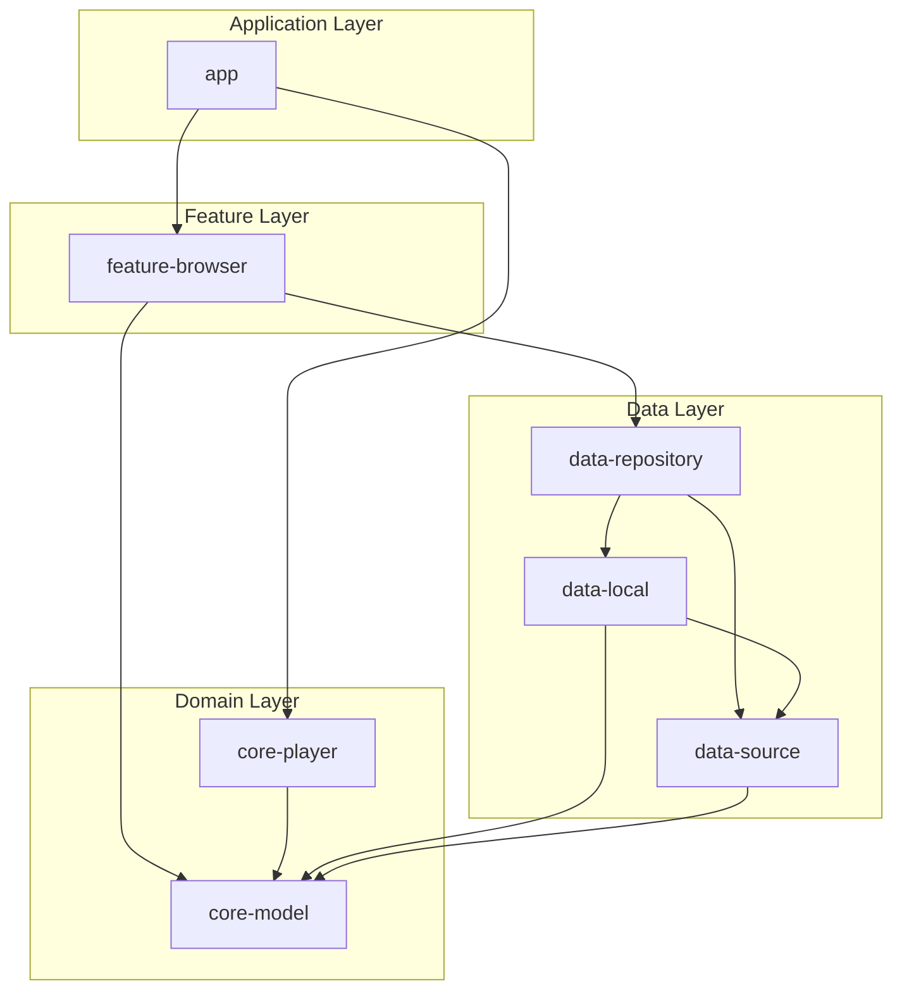
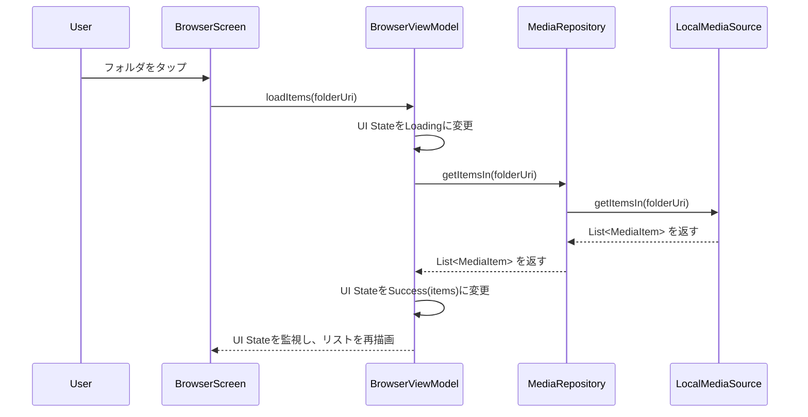
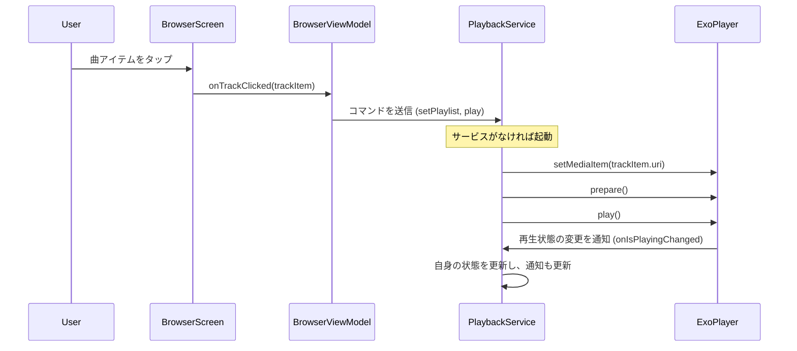

承知いたしました。循環参照の発見と `data-repository` モジュールの追加は、依存関係の方向を正しく保つための素晴らしい判断です。クリーンアーキテクチャの原則に、より忠実な設計になりますね。

ご提案に基づき、`Technical Design Document-Phase1.txt` を修正します。

---

## **技術設計書: Modular Stream Player (v1.0) - 改訂版**

### 1. アーキテクチャとモジュール構造

**1.1. 全体アーキテクチャ**
*   **クリーンアーキテクチャ**を参考にした、関心事の分離を徹底したマルチモジュール構成を採用する。
*   依存性のルールを徹底し、内側のレイヤー（`core-model`, `data-source`）は外側のレイヤーを知らない。**依存の方向は常に内側に向かう。**
*   **UI → ViewModel → Repository → DataSource** という一方向のデータフローを基本とする。
*   依存性の注入（DI）には **Hilt** を使用し、各レイヤー間の依存関係を疎結合に保つ。

**1.2. モジュール構成図（フェーズ1時点）**

循環参照を解消し、依存関係を明確にするため`data-repository`モジュールを追加しました。



*   **:app**: MainActivity, DIコンテナの初期化, Navigation Graphの定義。
*   **:feature-browser**: `BrowserScreen`, `PlayerScreen`のUIと`BrowserViewModel`, `PlayerViewModel`。`MediaRepository`を利用する。
*   **:core-player**: `PlaybackService` (Foreground Service), ExoPlayerの管理, 通知コントロール。
*   **:core-model**: アプリ共通のデータクラス (`MediaItem`, `PlaybackState`など)。どのモジュールからも依存されない、最も内側のレイヤー。
*   **:data-repository**: データ層へのアクセス窓口である`MediaRepository`の実装。`data-source`と`data-local`に依存。
*   **:data-source**: `MediaSource`インターフェースの定義。データソースの「契約」を定義する。
*   **:data-local**: `LocalMediaSource`の実装。ローカルストレージからのデータ取得ロジックを持つ。`data-source`のインターフェースを実装する。

---

### 2. 主要インターフェースとデータクラス定義

コーディングの「契約」となる部分を定義します。

#### **2.1. `:core-model`**

```kotlin
// MediaItem.kt
sealed interface MediaItem {
    val name: String
    val path: String
    val uri: String // 再生や識別に使うURI形式のID
}

data class FolderItem(
    override val name: String,
    override val path: String,
    override val uri: String
) : MediaItem

data class TrackItem(
    override val name: String,
    override val path: String,
    override val uri: String,
    val artist: String?,
    val album: String?,
    val artworkUri: String?, // Coilで読み込む用のアートワークURI
    val durationMs: Long
) : MediaItem
```

#### **2.2. `:data-source`**

データソースのインターフェース（契約）を定義します。

```kotlin
// MediaSource.kt
interface MediaSource {
    /** 指定されたパス（フォルダURI）直下のアイテムリストを取得する */
    suspend fun getItemsIn(folderUri: String?): List<MediaItem>

    // (フェーズ3以降) Coilでアートワークを読み込むためのカスタムFetcherを登録するメソッド
    // fun registerCoilExtensions(coilRegistry: ImageLoader.Builder)
}
```

#### **2.3. `:data-repository`**

ViewModelが利用するリポジトリを定義します。

```kotlin
// MediaRepository.kt
class MediaRepository @Inject constructor(
    private val localMediaSource: MediaSource // DIでインターフェースを注入
) {
    suspend fun getItemsIn(folderUri: String?): List<MediaItem> {
        // 現状はローカルのみだが、将来的にはここでメディアソースを切り替える
        // 例: if (isSmb) smbMediaSource.getItemsIn() else localMediaSource.getItemsIn()
        return localMediaSource.getItemsIn(folderUri)
    }
}
```
*Note: Hiltの`@Binds`を用いて、`MediaSource`インターフェースに`LocalMediaSource`実装を束縛する設定が別途必要です。*

---

### 3. 主要機能のシーケンス設計

#### **3.1. ファイルリスト表示シーケンス**

ユーザーがフォルダをタップしてからリストが更新されるまでの流れ。



#### **3.2. 音楽再生開始シーケンス (最重要)**

ユーザーが曲をタップしてから再生が開始されるまでの流れ。UIとバックグラウンドサービスが連携する。



---

### 4. 実装詳細と技術選定理由

#### **4.1. バックグラウンド再生 (`:core-player`)**
*   **`PlaybackService`**: `MediaLibraryService` (from Jetpack Media3) を継承して実装する。
    *   これにより、`MediaSession`のライフサイクル管理、通知の自動生成、他のメディアアプリ（Googleアシスタント等）との連携が大幅に簡略化される。
*   **`ExoPlayer`インスタンス**: `PlaybackService` 内でシングルトンとして管理する。
*   **UIとの通信**:
    *   **UI → Service**: `MediaController` (from Jetpack Media3) を使って再生/停止などのコマンドを送信する。
    *   **Service → UI**: `MediaController.Listener` を通じて、再生状態のコールバックを受け取り、ViewModelの`StateFlow`を更新する。

#### **4.2. ローカルメディアアクセス (`:data-local`)**
*   **権限**: `READ_MEDIA_AUDIO` (Android 13以上) または `READ_EXTERNAL_STORAGE` (それ以前) の権限が必要。
*   **データ取得**: `ContentResolver` と `MediaStore` API を使用して、デバイス上のオーディオファイル情報を効率的にクエリする。
    *   **Projection**: `MediaStore.Audio.Media._ID`, `DISPLAY_NAME`, `ARTIST`, `ALBUM`, `DURATION`などを指定して必要なカラムのみ取得する。
    *   `ContentUris.withAppendedId(MediaStore.Audio.Media.EXTERNAL_CONTENT_URI, id)` で各トラックのURIを生成する。これが `TrackItem.uri` となる。
*   **実装クラス**: `LocalMediaSource`クラスがこのロジックを担当する。

#### **4.3. アートワーク表示 (`:data-local` と Coilの連携)**
*   **課題**: `MediaStore`から直接アートワークのBitmapを取得するのは重い。URIで扱うのがモダンな方法。
*   **解決策**:
    1.  `TrackItem.artworkUri` には、アルバムIDから生成したアートワーク用のURI（例: `content://media/external/audio/albumart/{album_id}`）を格納する。
    2.  Coilは標準で `ContentResolver` を使った `content://` URIの読み込みをサポートしているため、特別な拡張なしで非同期読み込みが可能。
    ```kotlin
    // in BrowserScreen.kt
    AsyncImage(
        model = trackItem.artworkUri,
        contentDescription = "Album Art",
        placeholder = painterResource(id = R.drawable.ic_default_music_art)
    )
    ```

---

### 5. テスト戦略

*   **単体テスト (Unit Test)**:
    *   **対象**: ViewModel, Repositoryなど、Androidフレームワークに依存しないロジック。
    *   **ツール**: `JUnit5`, `MockK` (Mocking), `Turbine` (Flowのテスト)。
*   **インテグレーションテスト (Instrumentation Test)**:
    *   **対象**: `ContentResolver` を使った `LocalMediaSource` のクエリなど。
    *   **ツール**: `AndroidJUnit4`。
*   **UIテスト (UI Test)**:
    *   **対象**: Composeの画面とユーザー操作。
    *   **ツール**: `Espresso`, `Compose Test Rule`。