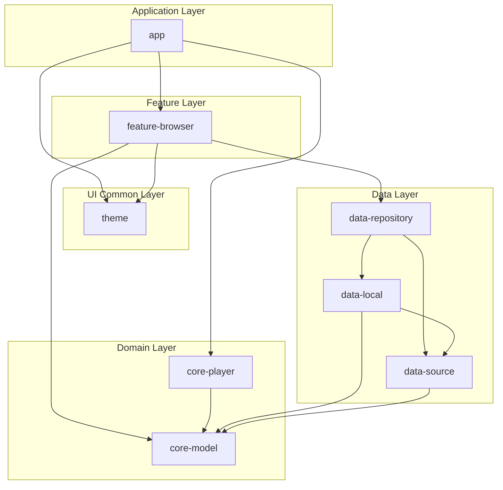
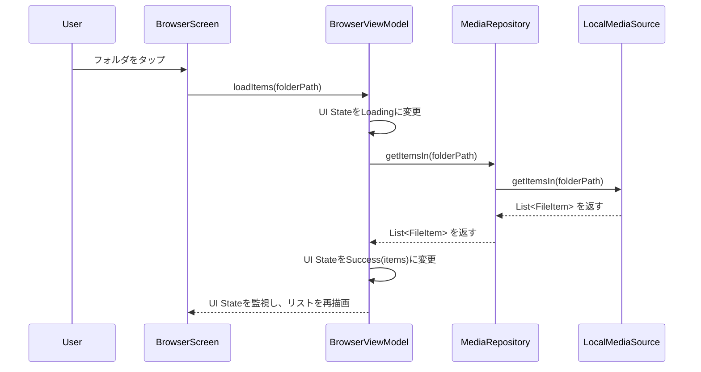
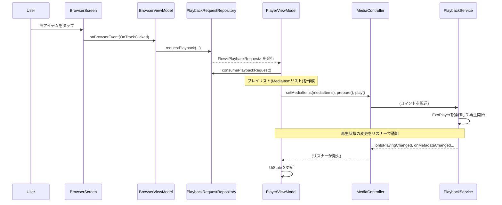

## **技術設計書: Modular Stream Player (v1.0)**

### 1. アーキテクチャとモジュール構造

**1.1. 全体アーキテクチャ**
*   **クリーンアーキテクチャ**を参考にした、関心事の分離を徹底したマルチモジュール構成を採用する。
*   依存性のルールを徹底し、内側のレイヤー（`core-model`, `data-source`）は外側のレイヤーを知らない。**依存の方向は常に内側に向かう。**
*   **UI → ViewModel → Repository → DataSource** という一方向のデータフローを基本とする。
*   依存性の注入（DI）には **Hilt** を使用し、各レイヤー間の依存関係を疎結合に保つ。

**1.2. モジュール構成図**



*   **:app**: アプリケーションのエントリーポイントと全体的なコンテナ。
    *   **ModularStreamPlayerApp.kt**: `@HiltAndroidApp` アノテーションを持つApplicationクラス。アプリ全体のDIコンテナを初期化する。
    *   **MainActivity.kt**: アプリの唯一のActivity (`@AndroidEntryPoint`)。Jetpack ComposeのUIツリーのルートとなり、`AppTheme`とナビゲーションホスト (`AppNavHost`) をセットアップする。
*   **:feature-browser**: ファイルブラウジングと再生に関連するUIとロジックの機能モジュール。
    *   **UI**: `BrowserScreen`, `PlayerScreen`, `AppDrawer` などのコンポーザブルを実装。
    *   **ViewModel**: `BrowserViewModel`, `PlayerViewModel` を実装。
    *   **Navigation**: `AppNavHost` を含み、アプリ内の画面遷移（ナビゲーショングラフ）を定義する。
*   **:core-player**: `PlaybackService` (Foreground Service), ExoPlayerの管理, 通知コントロール。
*   **:core-model**: アプリ共通のデータクラス (`FileItem`, `PlaybackState`など)。どのモジュールからも依存されない、最も内側のレイヤー。
*   **:theme**: アプリ全体の `MaterialTheme`、配色 (`ColorScheme`)、タイポグラフィ (`Typography`) を定義する。UIを持つモジュールから共通で利用される。
*   **:data-repository**: データ層へのアクセス窓口である`MediaRepository`, `SettingsRepository`などの実装。
*   **:data-source**: `MediaSource`インターフェースの定義。データソースの「契約」を定義する。
*   **:data-local**: `LocalMediaSource`の実装。ローカルストレージからのデータ取得ロジックを持つ。

---

### 2. 主要インターフェースとデータクラス定義

#### **2.1. `:core-model`**

```kotlin
// FileItem.kt
import android.os.Parcelable
import kotlinx.parcelize.Parcelize

sealed interface FileItem {
    val title: String
    val path: String
    val uri: String // 再生や識別に使うURI形式のID
}

@Parcelize
data class FolderItem(
    override val title: String,
    override val path: String,
    override val uri: String
) : FileItem, Parcelable

@Parcelize
data class TrackItem(
    override val title: String,
    override val path: String,
    override val uri: String,
    val artist: String?,
    val albumId: Long?, // アルバムアート取得などに利用
    val album: String?,
    val artworkUri: String?, // Coilで読み込む用のアートワークURI
    val durationMs: Long
) : FileItem, Parcelable
```

#### **2.2. `:data-source`**

```kotlin
// MediaSource.kt
interface MediaSource {
    /** 指定された物理パス（フォルダパス）直下のアイテムリストを取得する */
    suspend fun getItemsIn(folderPath: String?): List<FileItem>

    /** (将来の拡張用) Coilでアートワークを読み込むためのカスタムFetcherを登録する */
    // fun registerCoilExtensions(coilRegistry: ImageLoader.Builder)
}
```

#### **2.3. `:data-repository`**

```kotlin
// MediaRepository.kt
@Singleton
class MediaRepository @Inject constructor(
    private val localMediaSource: MediaSource // DIでインターフェースを注入
) {
    suspend fun getItemsIn(folderPath: String?): List<FileItem> {
        // 将来的にここでメディアソースを切り替える
        return localMediaSource.getItemsIn(folderPath)
    }
}
```

#### **2.4. UIからの再生要求の伝達 (`PlaybackRequestRepository`)**
UI（`BrowserViewModel`）からプレーヤー（`PlayerViewModel`）への再生要求を疎結合に伝達するため、`PlaybackRequestRepository` を導入します。

*   **役割**: `BrowserViewModel`でユーザーがトラックをタップした際に、そのトラック情報とプレイリスト（現在のフォルダ内の全アイテム）を含む`PlaybackRequest`オブジェクトを生成し、`StateFlow`で公開します。
*   **フロー**:
    1.  `BrowserViewModel` が `requestPlayback()` を呼び出す。
    2.  `PlaybackRequestRepository` は `StateFlow<PlaybackRequest?>` の値を更新する。
    3.  `PlayerViewModel` はこの`Flow`を購読しており、`null`でない新しい要求を受け取ると再生処理を開始する。
    4.  `PlayerViewModel` は処理開始後に `consumePlaybackRequest()` を呼び出し、`Flow`の値を`null`に戻して要求が再実行されるのを防ぐ。

---

### 3. 主要機能のシーケンス設計

#### **3.1. ファイルリスト表示シーケンス**



#### **3.2. 音楽再生開始シーケンス**


---

### 4. 実装詳細と技術選定理由

#### **4.1. バックグラウンド再生 (`:core-player`)**
*   **`PlaybackService`**: `MediaLibraryService` を継承し、`@AndroidEntryPoint` アノテーションを付与してHiltによる依存性注入を有効化する。
    *   **依存関係**: `ExoPlayer` インスタンスと `PlayerStateRepository` をHilt経由で注入する。
    *   **`MediaLibrarySession`**: `onCreate` で `MediaLibrarySession` をビルドし、サービスのメディアセッションとして公開する。これにより、UI側の `MediaController` との接続が可能になる。
    *   **状態同期**: `player.addListener` を使用して `Player.Listener` を登録し、`onIsPlayingChanged` コールバックを監視する。再生状態が変化すると、`playerStateRepository.setPlaying()` を呼び出してアプリ全体に状態を通知する。
    *   **ライフサイクル管理**:
        *   `onTaskRemoved`: アプリがタスク一覧からスワイプされた際、再生中でなければ `stopSelf()` を呼び出してサービスを自己終了させる。
        *   `onDestroy`: サービスが破棄される際に、`PlayerStateRepository` の状態をリセットし、`ExoPlayer` と `MediaLibrarySession` のリソースを解放 (`release()`) する。
*   **`ExoPlayer`インスタンス**: Hiltの `PlayerModule` によってシングルトンとして提供され、`PlaybackService` に注入される。設定には、音楽再生用の `AudioAttributes` や、イヤホンが抜かれた際に再生を一時停止する `setHandleAudioBecomingNoisy(true)` が含まれる。
*   **UIとの通信**:
    *   **UI → Service**: UI側の `MediaController` を通じて、再生、一時停止、プレイリスト設定などのコマンドが `PlaybackService` の `MediaLibrarySession` に送信される。
    *   **Service → UI (状態共有)**: `PlayerStateRepository` を介して、再生中/停止中の状態がUI（ViewModel）にリアクティブに伝達される。

#### **4.2. ローカルメディアアクセス (`:data-local`)**
*   **権限**: `READ_MEDIA_AUDIO` (Android 13以上) または `READ_EXTERNAL_STORAGE` (それ以前) の権限が必要。
*   **ルートパス**: 検索の起点となるルートパスは `/storage/emulated/0/Music` に固定されている。
*   **データ取得ロジック**:
    1.  **非同期実行**: `withContext(Dispatchers.IO)` を使用し、ファイルI/OとDBクエリをバックグラウンドスレッドで実行する。
    2.  **クエリ**: `ContentResolver` を使用し、`MediaStore.Audio.Media.EXTERNAL_CONTENT_URI` に対してクエリを実行する。
        *   **Projection**: `_ID`, `TITLE`, `DATA` (物理パス), `ARTIST`, `ALBUM`, `ALBUM_ID`, `DURATION` などを取得する。
        *   **Selection**: SQLの `LIKE` 句 (`DATA LIKE ?`) を用いて、指定されたフォルダパス(`currentPath`)配下にあるすべてのオーディオファイルを一度に取得する。これにより、サブフォルダを再帰的に検索するよりも効率的なデータ取得を実現する。
    3.  **アイテムの分類**:
        *   クエリ結果のカーソルをループ処理し、各ファイルの物理パス (`DATA`) を解析する。
        *   パスがカレントパス直下であれば `TrackItem` としてリストに追加する。
        *   パスがサブフォルダ内であれば、そのサブフォルダのパスを `Set` に保存しておく（重複排除のため）。
    4.  **リスト構築**:
        *   親フォルダへのナビゲーション (`..`) をリストの先頭に追加する（ルートパスでない場合）。
        *   抽出したサブフォルダパスから `FolderItem` を生成し、リストに追加する。
        *   抽出したトラック情報から `TrackItem` を生成し、リストに追加する。
*   **URI生成**:
    *   `TrackItem.uri`: `ContentUris.withAppendedId(MediaStore.Audio.Media.EXTERNAL_CONTENT_URI, id)` で生成し、再生用のURIとして利用する。
    *   `TrackItem.artworkUri`: `ContentUris.withAppendedId(Uri.parse("content://media/external/audio/albumart"), albumId)` で生成し、Coilでのアルバムアート表示に利用する。
