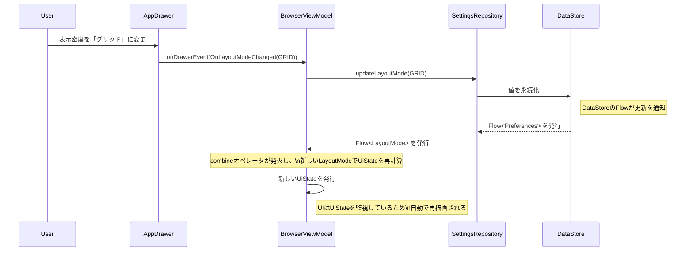
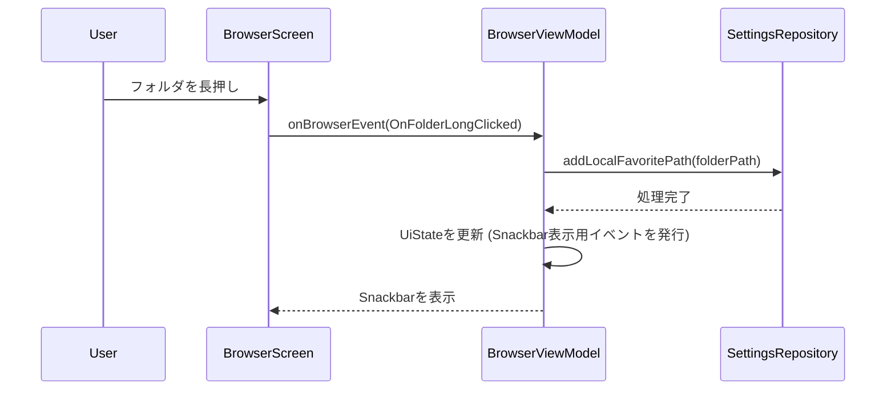

## **技術設計書: Modular Stream Player (Phase 2 - 差分)**

### 1. フェーズ2における技術的変更点
*   **設定管理**: UI設定（表示密度、画面モード）やお気に入りパスといったユーザー設定を永続化するため、`Jetpack DataStore`を導入します。
*   **メタデータ解析**: `MediaStore`を主軸とし、ブラウザ用とプレーヤー用で異なるアートワーク取得戦略を採用します。
*   **ViewModelの責務拡大**:
    *   **`BrowserViewModel`**:
        *   `SettingsRepository` から設定値（レイアウト、表示モード、お気に入り）の `Flow` を、内部状態Flowと共に `combine` し、最終的な `UiState` をUIに公開する。
        *   UIからのイベント (`BrowserEvent`, `DrawerEvent`) に応じて、`SettingsRepository` の更新メソッドや `MediaRepository` のデータ取得メソッドを呼び出す。
        *   曲がタップされた際には `PlaybackRequestRepository` を通じて再生要求を発行する。
    *   **`PlayerViewModel` (新規)**:
        *   `PlaybackRequestRepository` を購読し、新しい再生要求に応じて `PlaybackService` と連携して再生を開始する。
        *   `MediaController` のリスナーを通じて `PlaybackService` からの再生状態（曲情報、再生/一時停止、シーク位置など）の変更を購読し、自身の `UiState` を更新する。
*   **UIとプレーヤーの連携強化**: UIからの再生要求を`PlaybackRequestRepository`を介してPlayerに伝達し、Playerの状態変更を`MediaController.Listener`を通じてUIに反映させる、疎結合な連携モデルを確立します。

### 2. モジュール構造と依存関係の変更
*   既存のモジュール構成を維持します。設定値の管理ロジックは、データの永続化という観点から`data-`レイヤーに配置します。
*   **:data-repository**: `Jetpack DataStore`への依存関係を追加し、設定情報を管理する`SettingsRepository`を実装します。

### 3. 主要な技術的課題と解決策

#### 3.1. メタデータとアートワークの表示 (`F-19`)
*   **課題**: `MediaStore`で取得できる情報と、実際にプレーヤーで必要となる高品位な情報の分離。
*   **解決策**: 責務に応じたハイブリッドアプローチを採用します。

    1.  **ファイルブラウザ (`BrowserScreen`)での表示**:
        *   `LocalMediaSource`が`ContentResolver`を用いて、高速に取得できる基本的なメタデータと、アルバムアート用のURI (`content://media/external/audio/albumart/{album_id}`) を取得し、`TrackItem`に格納します。
        *   UIではCoilを用いてこの`artworkUri`を非同期に表示します。これにより、リストのスクロールパフォーマンスを維持します。

    2.  **再生画面 (`PlayerScreen`)での表示**:
        *   **`PlayerViewModel`**: `MediaController`を通じて、現在再生中の`MediaItem`から`MediaMetadata`を取得します。このメタデータには、`PlaybackService`が`ExoPlayer`から取得した、ファイルに埋め込まれているアートワークの**`ByteArray` (`artworkData`)** が含まれています。
        *   **`PlayerScreen`**: `PlayerUiState`に含まれる`artworkData` (`ByteArray`) を、Coilを用いて直接`AsyncImage`に読み込ませて表示します。これにより、`MediaStore`にキャッシュされていない高解像度の埋め込みアートワークを表示できます。

#### 3.2. UI設定とお気に入りパスの永続化 (`F-20`, `F-21`, `F-25`, `F-28`, `NF-08`)
*   **課題**: 型安全かつ非同期で設定値を読み書きする方法。
*   **解決策**: `Jetpack Preferences DataStore`を利用します。
    1.  **`SettingsRepository`の実装 (`:data-repository`)**:
        *   `DataStore<Preferences>`のインスタンスをDIで受け取ります。
        *   表示密度(`LayoutMode`)、画面モード(`ViewMode`)、お気に入りパス(`Set<String>`)、デフォルトパス(`String`)などを保存するための`Preferences.Key`を定義します。
        *   各設定値の読み取り用に`Flow<T>`を公開し、書き込み用に`suspend fun update...()`メソッドを提供します。
        ```kotlin
        // :data-repository/SettingsRepository.kt

        // UI設定を表現するEnumクラス
        enum class LayoutMode { LIST, GRID_MEDIUM, GRID_SMALL }
        enum class ViewMode { SINGLE, DUAL }

        @Singleton
        class SettingsRepository @Inject constructor(@ApplicationContext context: Context) {
            private val dataStore = context.dataStore

            // DataStoreのキー定義
            private object PreferencesKeys { ... }

            // 各設定値を読み取るFlow
            val layoutMode: Flow<LayoutMode> = dataStore.data.map { prefs -> ... }
            val viewMode: Flow<ViewMode> = dataStore.data.map { prefs -> ... }
            val localFavoritePaths: Flow<Set<String>> = dataStore.data.map { prefs -> ... }
            val localDefaultPath: Flow<String> = dataStore.data.map { prefs -> ... }

            // 各設定値を更新するsuspend関数
            suspend fun updateLayoutMode(mode: LayoutMode) { ... }
            suspend fun updateViewMode(mode: ViewMode) { ... }
            suspend fun addLocalFavoritePath(path: String) { ... }
            suspend fun removeLocalFavoritePath(path: String) { ... }
            suspend fun updateLocalDefaultPath(path: String) { ... }
        }
        ```
    2.  **`ViewModel`での利用**:
        *   `BrowserViewModel`は`SettingsRepository`から設定値の`Flow`を`collect`し、他の状態と`combine`して`StateFlow<UiState>`に変換しUIに公開します。
        *   ユーザーがUIから設定を変更すると、`ViewModel`は`SettingsRepository`の更新メソッドを呼び出します。

#### 3.3. 再生状態のUIへの反映
*   **課題**: バックグラウンドの`PlaybackService`の状態変更を、UI（`PlayerScreen`）に効率的かつリアクティブに伝達する方法。
*   **解決策**: `MediaController`と`Player.Listener`による標準的な連携を行います。
    1.  **`PlayerViewModel`**: `MediaController`のインスタンスを保持し、`Player.Listener`を登録します。
    2.  **`PlaybackService`**: `ExoPlayer`で再生状態（曲の遷移、再生/一時停止、メタデータの変更など）が変化すると、`MediaSession`を通じて接続されている`MediaController`に通知します。
    3.  **UIへの反映**: `PlayerViewModel`のリスナーがコールバック（`onMediaMetadataChanged`, `onIsPlayingChanged`など）を受け取り、それに応じて`PlayerUiState`を更新します。`PlayerScreen`はこの`UiState`を監視しているため、自動的にUIが再描画されます。

### 4. シーケンス図 (追加・変更部)

#### 4.1. 表示密度変更シーケンス



#### 4.2. お気に入りパス追加シーケンス

