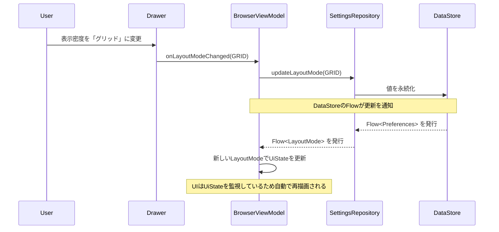
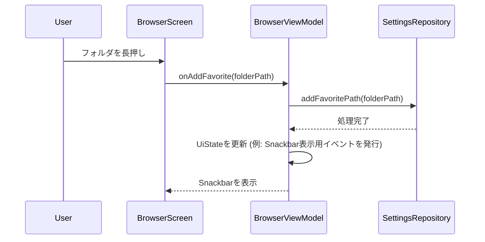

## **技術設計書: Modular Stream Player (Phase 2 - 差分)**

### 1. フェーズ2における技術的変更点
*   **設定管理**: UI設定（表示密度、画面モード）やお気に入りパスといったユーザー設定を永続化するため、`Jetpack DataStore`を導入します。
*   **メタデータ解析**: `MediaStore`で不足する情報を補うため、ID3タグ解析ライブラリ`mp3agic`を導入します。
*   **ViewModelの責務拡大**: UI設定の変更や、お気に入りパスのCRUD操作、`PlaybackService`からの状態変更の購読など、管理する状態が増加します。
*   **UIとプレーヤーの連携強化**: 再生中の曲が変更された際に、ファイルブラウザ上の対応するアイテムにフォーカスを当てるなど、コンポーネント間の連携を密にします。

### 2. モジュール構造と依存関係の変更
*   既存のモジュール構成を維持します。設定値の管理ロジックは、データの永続化という観点から`data-`レイヤーに配置します。
*   **:data-local**: `mp3agic`ライブラリへの依存関係を追加します。
*   **:data-repository**: `Jetpack DataStore`への依存関係を追加し、設定情報を管理する`SettingsRepository`を実装します。

### 3. 主要な技術的課題と解決策

#### 3.1. ID3タグとアートワークの解析・表示 (`F-19`)
*   **課題**: 多数のファイルのメタデータを取得する際のパフォーマンス低下。
*   **解決策**: ハイブリッドアプローチを採用します。
    1.  **`LocalMediaSource`の責務**:
        *   まず`ContentResolver`を用いて、高速に取得できる基本的なメタデータ（`ARTIST`, `TITLE`, `ALBUM_ID`など）を取得します。
        *   `TrackItem.artworkUri`には、Coilが直接解釈できる`content://media/external/audio/albumart/{album_id}`形式のURIを格納します。
        *   `ContentResolver`でアートワークが取得できない場合（`album_id`がない、など）や、より詳細な情報が必要な場合に備え、ファイルの物理パスも`TrackItem`に含めておきます。
    2.  **`mp3agic`の利用**:
        *   埋め込みアートワークが必要な場合（`artworkUri`がnullの時など）に限定して、`mp3agic`を使用します。`mp3agic`でファイルからアートワークの`ByteArray`を抽出し、Coilで表示します。この処理は重いため、`ViewModel`または`Repository`層で非同期に実行します。
    3.  **Coilの拡張**:
        *   `mp3agic`で抽出した`ByteArray`をCoilで扱うため、特別な拡張は不要です（Coilは`ByteArray`を直接モデルとして扱える）。

#### 3.2. UI設定とお気に入りパスの永続化 (`F-20`, `F-21`, `F-25`, `F-28`, `NF-08`)
*   **課題**: 型安全かつ非同期で設定値を読み書きする方法。
*   **解決策**: `Jetpack Preferences DataStore`を利用します。
    1.  **`SettingsRepository`の実装 (`:data-repository`)**:
        *   `DataStore<Preferences>`のインスタンスをDIで受け取ります。
        *   表示密度(`LayoutMode`)、画面モード(`ViewMode`)、お気に入りパス(`Set<String>`)などを保存するための`Preferences.Key`を定義します。
        *   各設定値の読み取り用に`Flow<T>`を公開し、書き込み用に`suspend fun update...()`メソッドを提供します。
        ```kotlin
        // SettingsRepository.kt (in :data-repository)
        class SettingsRepository @Inject constructor(private val dataStore: DataStore<Preferences>) {
            // 表示密度のFlow
            val layoutMode: Flow<LayoutMode> = dataStore.data.map { prefs -> ... }
            // 表示密度を更新するメソッド
            suspend fun updateLayoutMode(mode: LayoutMode) { ... }
            
            // お気に入りパスのFlow
            val favoritePaths: Flow<Set<String>> = dataStore.data.map { prefs -> ... }
            // お気に入りパスを追加/削除するメソッド
            suspend fun addFavoritePath(path: String) { ... }
            suspend fun removeFavoritePath(path: String) { ... }
        }
        ```
    2.  **`ViewModel`での利用**:
        *   `BrowserViewModel`は`SettingsRepository`から設定値の`Flow`を`collect`し、`StateFlow<UiState>`に変換してUIに公開します。
        *   ユーザーがUIから設定を変更すると、`ViewModel`は`SettingsRepository`の更新メソッドを呼び出します。

#### 3.3. 曲移動とブラウザカーソルの同期 (`F-13(改訂)`)
*   **課題**: バックグラウンドの`PlaybackService`の状態変更を、UI（`BrowserScreen`）に効率的かつリアクティブに伝達する方法。
*   **解決策**: 共有された再生状態`Flow`を介した連携を行います。
    1.  **`PlaybackService`**: `MediaController`のリスナーを通じて現在再生中の`MediaItem`が変更されたことを検知し、その`uri`を`StateFlow`で公開するリポジトリ（例: `PlayerStateRepository`）の値を更新します。
    2.  **`PlayerStateRepository` (`:core-player` or `:data-repository`)**: 現在の再生状態（再生中/停止中、現在の曲のURIなど）を保持する`StateFlow`を持つシングルトンクラス。`PlaybackService`が状態を書き込み、各`ViewModel`が読み取ります。
    3.  **`BrowserViewModel`**: `PlayerStateRepository`から現在の曲の`uri`を`collect`します。
    4.  **UIへの反映**: `ViewModel`内で、`uri`の変更を検知したら、現在ブラウザが表示している`List<MediaItem>`の中から一致するアイテムを探し、そのインデックスを`UiState`に含めます。`BrowserScreen`はこのインデックスを元に`LazyListState.animateScrollToItem()`を呼び出し、該当アイテムの背景色を変更するなどしてフォーカスを可視化します。

### 4. シーケンス図 (追加・変更部)

#### 4.1. 表示密度変更シーケンス



#### 4.2. お気に入りパス追加シーケンス


