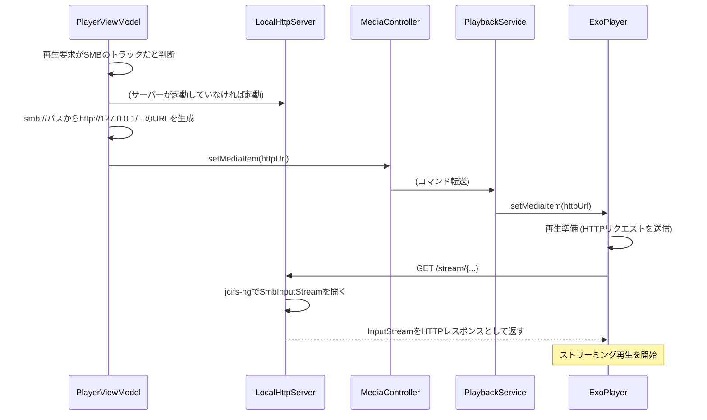

## **技術設計書: Modular Stream Player (Phase 3 - 差分)**

### 1. フェーズ3における技術的変更点
本フェーズの最大の目的は、データソースとしてNAS(SMB)をサポートすることです。これに伴い、データ層と再生ロジックに大幅な変更が加わります。

*   **SMB通信**: SMBプロトコルによるファイル操作を実現するため、`jcifs-ng`ライブラリを導入します。
*   **認証情報の安全な保存**: NASの接続情報を暗号化して保存するため、`Jetpack Security (EncryptedSharedPreferences)`を導入します。
*   **ストリーミング再生対応**: ExoPlayerは`smb://`プロトコルを直接再生できないため、SMB上のファイルストリームを`http://localhost`経由で提供する**ローカルHTTPサーバー** (`NanoHTTPD`)を導入します。
*   **データ層の拡張**: `MediaSource`インターフェースを実装する`SmbMediaSource`と、NAS接続情報を管理する`NasCredentialsRepository`を新設します。
*   **ViewModelとRepositoryの連携**: どのデータソース（ローカル or 特定のNAS）を利用しているかを管理し、`MediaRepository`が適切な`MediaSource`に処理を委譲する仕組みを構築します。

### 2. モジュール構造と依存関係の変更
*   **`:data-smb` (新規)**: SMB通信に関連する実装を格納する新モジュール。
    *   `jcifs-ng`ライブラリへの依存関係を追加。
    *   `SmbMediaSource`を実装。
*   **`:data-repository`**:
    *   `Jetpack Security`ライブラリへの依存関係を追加。
    *   `NasCredentialsRepository`を実装。
*   **`:core-player`**:
    *   `NanoHTTPD`ライブラリへの依存関係を追加。
    *   SMBストリームを中継する`LocalHttpServer`を実装。

### 3. 主要な技術的課題と解決策

#### 3.1. NAS接続情報の管理 (`F-01`, `F-02`, `F-04`, `NF-05`)
*   **課題**: ユーザー名やパスワードを含む接続情報を、安全かつ永続的に管理する方法。
*   **解決策**: `EncryptedSharedPreferences`を利用した`NasCredentialsRepository`を実装します。
    1.  **`NasCredentialsRepository` (`:data-repository`)**:
        *   `EncryptedSharedPreferences`のインスタンスをDIで受け取ります。
        *   NAS接続情報（ニックネーム、ホスト、パス、ユーザー名、暗号化済みパスワード）をJSON文字列にシリアライズし、単一のキーで保存・管理します。
        *   接続情報リストのCRUD操作（`save`, `getAll`, `delete`）を行うメソッドを提供します。
        *   `Flow<List<NasConnection>>`を公開し、UIが接続情報の変更をリアクティブに監視できるようにします。
    2.  **`SettingsViewModel` (新規)**:
        *   `NasCredentialsRepository`を利用して、NAS接続一覧の表示や、追加・編集・削除処理を行います。

#### 3.2. SMB上のファイルリスト取得 (`A-03`)
*   **課題**: `jcifs-ng`を使用してSMBサーバーに接続し、ファイル/フォルダのリストをアプリのモデル(`FileItem`)に変換する必要がある。
*   **解決策**: `MediaSource`インターフェースを実装する`SmbMediaSource`を`data-smb`モジュールに作成します。
    1.  **`SmbMediaSource`の実装**:
        *   コンストラクタで接続情報(`NtlmPasswordAuthentication`)を受け取ります。
        *   `getItemsIn(folderPath)`が呼び出されると、`jcifs-ng`の`SmbFile(path, auth)`を使用して指定されたパスにアクセスします。
        *   `smbFile.listFiles()`で取得した`SmbFile`オブジェクトをループ処理し、ディレクトリなら`FolderItem`、ファイルなら`TrackItem`にマッピングして返します。
        *   **Note**: SMB上のファイルのメタデータ（ID3タグ）は、この段階では取得しません。パフォーマンス向上のため、ファイル名のみでリストを構成します。

#### 3.3. SMBファイルのストリーミング再生 (`F-09`)
*   **課題**: `ExoPlayer`は`smb://`スキーマのURIを直接再生できない。
*   **解決策**: `PlaybackService`内に軽量なHTTPサーバー(`NanoHTTPD`)を立て、SMBストリームをHTTPストリームに中継します。
    1.  **`LocalHttpServer` (`:core-player`)**:
        *   `NanoHTTPD`を継承したシングルトンクラスとして実装します。
        *   HTTPリクエストを受け取ると、リクエストパスから対応するSMBファイルのパスを特定し、`jcifs-ng`で`SmbInputStream`を開きます。
        *   その`InputStream`をHTTPレスポンスとして返すことで、ストリーミングを実現します。
    2.  **再生要求フローの変更**:
        *   `PlayerViewModel`は、再生要求された`TrackItem`がSMB由来であるかを判断します。
        *   SMB由来の場合、`track.path`をエンコードしたローカルURL（例: `http://127.0.0.1:8080/stream/{encoded_smb_path}`）を生成します。
        *   このHTTP URLを`MediaItem.Builder().setUri()`に設定し、`MediaController`を通じて`PlaybackService`に再生を指示します。
    3.  **`PlaybackService`**: `ExoPlayer`は`http://127.0.0.1:8080/...`にアクセスし、`LocalHttpServer`がSMBからの中継ストリームを提供します。

### 4. シーケンス図 (追加・変更部)

#### 4.1. SMBメディアの再生開始シーケンス

