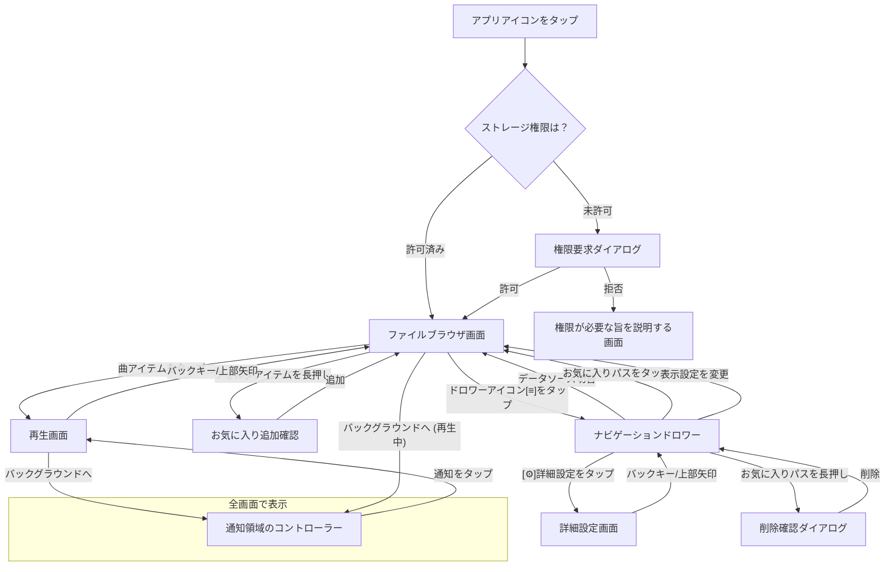

## **UI/UX設計書: Modular Stream Player (v1.0)**

### 1. 全体コンセプト

*   **デザイン**: マテリアルデザイン3 (Material You) に準拠する。
    *   **ダイナミックカラー**: Android 12 (API 31) 以上のデバイスでは、ユーザーの壁紙やテーマ設定に合わせた配色（ダイナミックカラー）を適用し、パーソナライズされた体験を提供する。
    *   **フォールバック配色**: ダイナミックカラーが利用できない、または無効化されている場合は、ライト/ダークテーマそれぞれに定義されたカスタムカラーパレットを使用する。
    *   **タイポグラフィ**: `MaterialTheme` に定義されたタイポグラフィシステムを利用し、一貫性のあるテキストスタイルを適用する。
*   **ナビゲーション**: `MainActivity`による単一Activity構成を基本とする。画面遷移は`Jetpack Compose Navigation`で実装し、`:feature-browser`モジュール内の`AppNavHost`コンポーザブルでナビゲーショングラフ（`Browser`, `Player`, `Settings`の各画面へのルート）を定義する。

### 2. 画面遷移図 (Screen Flow)

ユーザーの基本的な操作の流れを図示します。



### 3. ワイヤーフレーム (Wireframes)

各画面のレイアウトと主要コンポーネントを定義します。

---

#### **3.1. ファイルブラウザ画面 (BrowserScreen)**

**目的**: ユーザーがストレージ内の音楽ファイルやフォルダを閲覧し、再生したい曲を選択する。

**[ワイヤーフレーム]**
```
+------------------------------------------------------+
| [≡] Modular Stream Player                          |  <-- トップバー (TopAppBar)
+------------------------------------------------------+
| /storage/emulated/0/Music/                         |  <-- 現在のパス表示 (Breadcrumbs)
+------------------------------------------------------+
|                                                      |
|  [📁] .. (親フォルダへ)                              |  <-- リストアイテム (フォルダ)
|  --------------------------------------------------  |
|  [📁] Rock                                           |  (長押しでお気に入り追加)
|  --------------------------------------------------  |
|  [🎵] great_song.mp3                                 |  <-- リストアイテム (ファイル)
|      (ファイル名)                                    |
|  --------------------------------------------------  |
|  [🖼️] Another Brick in the Wall                     |
|      Pink Floyd                                      |
|  --------------------------------------------------  |
|                                                      |
+------------------------------------------------------+
```

**コンポーネント詳細:**

*   **トップバー (TopAppBar)**:
    *   `[≡]` (ナビゲーションドロワーアイコン): タップするとナビゲーションドロワーを開く。
    *   **アプリ名/画面名**: "Modular Stream Player"
*   **現在のパス表示 (Breadcrumbs)**:
    *   現在表示しているフォルダのパスを示す。
*   **リストアイテム (LazyColumn / LazyGrid)**:
    *   **操作**:
        *   フォルダアイテムをタップ: そのフォルダに移動。
        *   ファイルアイテムをタップ: 再生画面に遷移またはミニプレーヤーで再生開始。
        *   フォルダアイテムを長押し: そのフォルダを「お気に入りパス」に追加するアクションを提示する。

---

#### **3.2. 再生画面 (PlayerScreen)**

**目的**: 現在再生中の曲に関する詳細情報を表示し、再生コントロール機能を提供する。

**[ワイヤーフレーム]**
```
+------------------------------------------------------+
| [↓]                                   [⠇]           |  <-- トップバー
+------------------------------------------------------+
|                                                      |
|           +--------------------------+               |
|           |      アルバムアート       |               |
|           +--------------------------+               |
|                                                      |
|             Another Brick in the Wall                |  <-- 曲名 (Text)
|                   Pink Floyd                         |  <-- アーティスト名 (Text)
|                                                      |
+------------------------------------------------------+
| 01:23  /--●------------------------/  03:55          |  <-- シークバー (Slider) + 時間表示
+------------------------------------------------------+
|       [🔀]     [⏮️]     [▶️]     [⏭️]     [🔁]        |  <-- 再生コントロール
+------------------------------------------------------+
```

**コンポーネント詳細:**

*   `[↓]` (閉じるアイコン): タップするとファイルブラウザ画面に戻る。
*   **アルバムアート**: `Coil`で非同期読み込み。
*   **再生コントロール**: 再生/一時停止、曲移動など。

---

#### **3.3. ナビゲーションドロワー (NavigationDrawer)**

**目的**: データソースの切り替え、表示設定、お気に入りパスへのショートカット、設定へのアクセスを提供する。

**[ワイヤーフレーム]**
```
+----------------------------------+
| Modular Stream Player            |
| (アプリヘッダー)                 |
+----------------------------------+
| データソースの更新 [🔄]          |
+----------------------------------+
| ▼ データソース                   |
|   ◉ ローカルストレージ           |
|   ○ NAS-Server (SMB)             |
+----------------------------------+
| ▼ 表示設定                       |
|   画面モード                     |
|     ◉ 1画面   ○ 2画面            |
|   表示密度                       |
|     ◉ リスト  ○ グリッド(中)     |
|     ○ グリッド(小)               |
+----------------------------------+
| ▼ お気に入り (ローカル) [∨]      |
|   [⭐] Downloads                 |
|   (長押しで削除)                 |
+----------------------------------+
| [⚙️] 詳細設定                    |
+----------------------------------+
```

---

#### **3.4. 詳細設定画面 (SettingsScreen)**

**目的**: 変更頻度の低い永続的な設定（NAS接続情報、デフォルトパス等）を行う。

**[ワイヤーフレーム]**
```
+------------------------------------------------------+
| [←] 詳細設定                                         |
+------------------------------------------------------+
|                                                      |
|  NAS接続設定                                         |
|  NASサーバーを管理します                               |
|  --------------------------------------------------  |
|  ローカルストレージ設定                              |
|  デフォルトパス: /storage/emulated/0/Music        |
|  --------------------------------------------------  |
|  NAS-Server (SMB) 設定                              |
|  デフォルトパス: /Public/Music                    |
|                                                      |
+------------------------------------------------------+
```

---

#### **3.5. 通知領域のコントローラー**

**目的**: アプリがバックグラウンドにある場合でも、ユーザーが音楽をコントロールできるようにする。

**[ワイヤーフレーム]**
```
+------------------------------------------------------+
| [🖼️]  **Another Brick in the Wall**    [⏮️] [⏸️] [⏭️] [X] |
|       Pink Floyd                                     |
+------------------------------------------------------+
```

**コンポーネント詳細:**
*   `Jetpack Media3` の `MediaSession` と `MediaNotification.Provider` を使うことで、このUIはOS標準の仕組みで実装可能。
*   コントロールには、前の曲へ、再生/一時停止、次の曲へ、サービス停止ボタンが含まれる。
