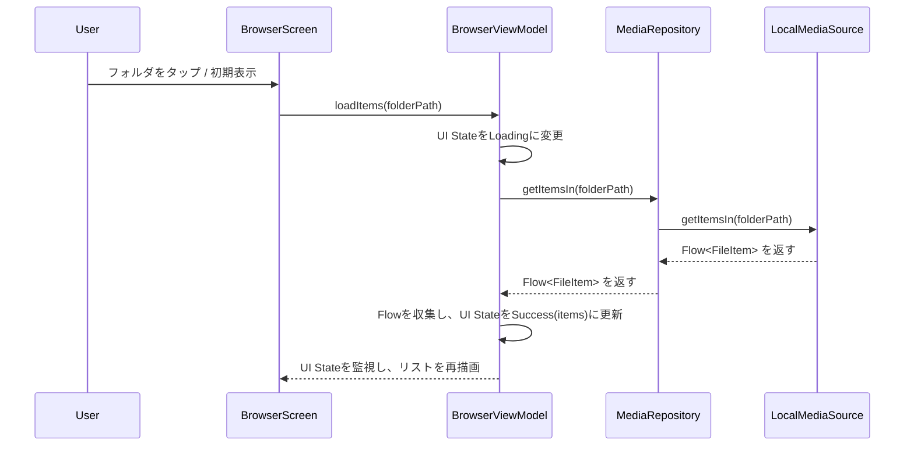
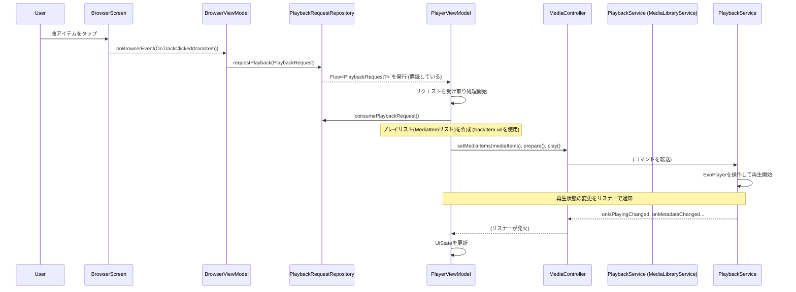

## 技術設計書: Modular Stream Player (Phase 1 - ローカルファイラー基盤)

### 1. はじめに

このドキュメントは、「Modular Stream Player」開発プロジェクトのフェーズ1（ローカルファイラー基盤構築）における技術設計を定義します。本ドキュメントは、プロジェクト全体の技術設計を定義する `Technical Design Document - Overview.md` を基盤とし、フェーズ1で実装された範囲に特化した詳細を記述します。

**フェーズ1のゴール**: ローカルストレージ内の音楽ファイルを閲覧・再生できる最低限のファイラーアプリを完成させる。

### 2. フェーズ1におけるアーキテクチャとモジュール

`Technical Design Document - Overview.md` で定義された全体アーキテクチャに基づき、フェーズ1では以下のモジュール群の初期実装を行いました。

*   **:app**: アプリケーションのエントリーポイント、MainActivity。
*   **:feature-browser**: ファイルブラウジング画面 (`BrowserScreen.kt`) の初期版、再生画面 (`PlayerScreen.kt`) のプレースホルダー、および関連する `BrowserViewModel.kt`、`PlayerViewModel.kt` の初期版。
*   **:core-player**: `PlaybackService.kt` の初期版（ローカルファイル再生対応）、`ExoPlayer` の基本的なセットアップ。
*   **:core-model**: `FileItem.kt` (`FolderItem`, `TrackItem`) などの基本的なデータクラス。
*   **:data-repository**: `SettingsRepository.kt` の初期版（UI設定などのプレースホルダー）、`PlayerStateRepository.kt`、`PlaybackRequestRepository.kt` の初期版。
*   **:data-media-repository**: `MediaRepository.kt` の初期版（ローカルデータソースのみ対応）。
*   **:data-source**: `MediaSource.kt` インターフェース定義。
*   **:data-local**: `LocalMediaSource.kt` の実装（`MediaStore` を利用したローカルファイルアクセス）。
*   **:theme**: アプリの基本的なテーマ設定。

**(フェーズ1時点での主要モジュール構成図 - 簡略版)**

```mermaid
graph TD
    subgraph "Presentation Layer (UI & ViewModel)"
        app
        feature_browser["feature-browser (Local browse/play UI)"]
        theme
    end

    subgraph "Domain Layer (Core Logic & Models)"
        core_model
        core_player["core-player (Local playback)"]
    end

    subgraph "Data Layer (Repositories, DataSources)"
        data_media_repository["data-media-repository (Local only)"]
        data_repository["data-repository (Basic settings, Playback state)"]
        data_source["data-source (MediaSource Interface)"]
        data_local["data-local (MediaStore access)"]
    end

    app --> feature_browser
    app --> theme
    app --> core_player %% PlaybackServiceの起動等

    feature_browser --> core_model
    feature_browser --> data_media_repository
    feature_browser --> data_repository
    feature_browser --> core_player %% MediaController経由
    feature_browser --> theme

    core_player --> core_model

    data_media_repository --> core_model
    data_media_repository --> data_source
    data_media_repository --> data_local
    data_media_repository --> data_repository %% SettingsRepository

    data_local --> core_model
    data_local --> data_source

    data_repository --> core_model
    data_source --> core_model
```

### 3. 主要インターフェースとデータクラス定義 (フェーズ1範囲)

主要なデータクラス (`FileItem`, `TrackItem`) は `Technical Design Document - Overview.md` で定義されたものを利用します。
フェーズ1で特に重要なインターフェースは `MediaSource` です。

#### 3.1. `:data-source` (`MediaSource.kt`)

```kotlin
package com.example.data_source

import com.example.core_model.FileItem
import com.example.core_model.TrackItem
import kotlinx.coroutines.flow.Flow

interface MediaSource {
    fun getItemsIn(folderPath: String?): Flow<FileItem>
    suspend fun getTrackDetails(trackItem: TrackItem): TrackItem
}
```

#### 3.2. `:data-local` (`LocalMediaSource.kt`)

`MediaSource`インターフェースのローカルストレージ向け実装です。

```kotlin
package com.example.data_local

import android.content.Context
import android.provider.MediaStore
import com.example.core_model.FileItem
import com.example.core_model.FolderItem
import com.example.core_model.TrackItem
import com.example.data_repository.di.IoDispatcher // from data-repository
import com.example.data_source.MediaSource
import dagger.hilt.android.qualifiers.ApplicationContext
import kotlinx.coroutines.CoroutineDispatcher
import kotlinx.coroutines.flow.Flow
import kotlinx.coroutines.flow.flow
import kotlinx.coroutines.flow.flowOn
import kotlinx.coroutines.withContext
import javax.inject.Inject

class LocalMediaSource @Inject constructor(
    @ApplicationContext private val context: Context,
    @IoDispatcher private val ioDispatcher: CoroutineDispatcher
) : MediaSource {

    override fun getItemsIn(folderPath: String?): Flow<FileItem> = flow {
        // ContentResolverを使用してMediaStoreから指定パスのファイル/フォルダリストを取得
        // ".." (親フォルダ) アイテムも適切に含める
        // フォルダはFolderItem、音楽ファイルはTrackItemとしてemit
        // 全てのファイルI/Oとカーソル処理は ioDispatcher で実行
    }.flowOn(ioDispatcher)

    override suspend fun getTrackDetails(trackItem: TrackItem): TrackItem = withContext(ioDispatcher) {
        // ContentResolverを使用してMediaStoreからトラックのメタデータ(アーティスト、アルバム等)を再取得・更新
        // (getItemsInで基本的な情報は取得済みだが、より詳細な情報や最新の状態を反映させるために実装)
        return@withContext trackItem // 更新されたTrackItemを返す
    }
}
```

### 4. 主要機能のシーケンス設計 (フェーズ1範囲)

#### 4.1. ローカルファイルリスト表示シーケンス



#### 4.2. ローカル音楽再生開始シーケンス



### 5. 実装詳細と技術選定理由 (フェーズ1範囲)

#### 5.1. バックグラウンド再生 (`:core-player`)

*   **`PlaybackService`**: `MediaLibraryService` を継承。ローカルファイルのURI (`content://...`) を直接扱える `ExoPlayer` インスタンスを管理。Hiltにより `@AndroidEntryPoint` として依存性を注入。
*   **通知**: メディアセッションと連携し、基本的な再生コントロール（再生/一時停止、曲情報）を通知領域に表示。`MediaNotification.Provider` のカスタマイズは初期段階では最小限。
*   **状態管理**: `PlayerStateRepository` を介して、再生中/停止中の状態がUI（`PlayerViewModel`）にリアクティブに伝達される。
*   `Technical Design Document - Overview.md` の「主要技術スタック」および「データフローの基本パターン」も参照。

#### 5.2. ローカルメディアアクセス (`:data-local`, `:data-media-repository`)

*   **権限**: `READ_MEDIA_AUDIO` (Android 13+) または `READ_EXTERNAL_STORAGE`。アプリ起動時または関連機能利用時にパーミッションリクエストを行う。
*   **`LocalMediaSource`**:
    *   `ContentResolver` と `MediaStore.Audio.Media.EXTERNAL_CONTENT_URI` を使用して音楽ファイル情報をクエリ。
    *   取得するカラム: `_ID`, `TITLE`, `DATA` (パス), `ARTIST`, `ALBUM`, `ALBUM_ID`, `DURATION` など。
    *   指定されたフォルダパス (`folderPath`) に基づいてアイテムをフィルタリング。`folderPath` がnullの場合は、デフォルトのミュージックフォルダ（例：`/storage/emulated/0/Music`、これは `SettingsRepository` から取得することを検討）を起点とする。
    *   `TrackItem.uri` は `ContentUris.withAppendedId()` を使用して `content://` スキームのURIを生成。
    *   `TrackItem.artworkUri` は `ContentUris.withAppendedId(Uri.parse("content://media/external/audio/albumart"), albumId)` で生成。
    *   全ての処理は `Dispatchers.IO` で実行。
*   **`MediaRepository`**:
    *   フェーズ1では、アクティブなデータソースは常に `LocalMediaSource` であると想定（DIにより注入）。
    *   `ViewModel` からの要求を `LocalMediaSource` に委譲する。

#### 5.3. UIとViewModel (`:feature-browser`)

*   **`BrowserViewModel`**:
    *   `MediaRepository` を通じてファイル/フォルダリスト (`Flow<FileItem>`) を取得し、UI状態 (`BrowserUiState`) として公開。
    *   フォルダタップ時には `currentPath` を更新し、リストを再読み込み。
    *   トラックタップ時には `PlaybackRequestRepository` を通じて再生要求を `PlayerViewModel` に伝達。この時、現在のフォルダ内のトラックリストもプレイリストとして渡す。
*   **`PlayerViewModel`**:
    *   `PlaybackRequestRepository` から再生要求を受け取り、`MediaController` を介して `PlaybackService` に再生指示（`setMediaItems`, `seekToDefaultPosition(startIndex)`, `prepare`, `play`など）を出す。
    *   `MediaController.Listener` を通じて再生状態（曲名、アーティスト名、再生/一時停止状態、再生時間など）を取得し、UI状態 (`PlayerUiState`) として公開。
*   **`BrowserScreen.kt`**: `BrowserUiState` をもとにリスト表示（初期は`LazyColumn`）。アイテムタップイベントを `BrowserViewModel` に通知。
*   **`PlayerScreen.kt`**: `PlayerUiState` をもとに再生情報を表示し、再生コントロール（再生/一時停止ボタンなど）のイベントを `PlayerViewModel` に通知。

