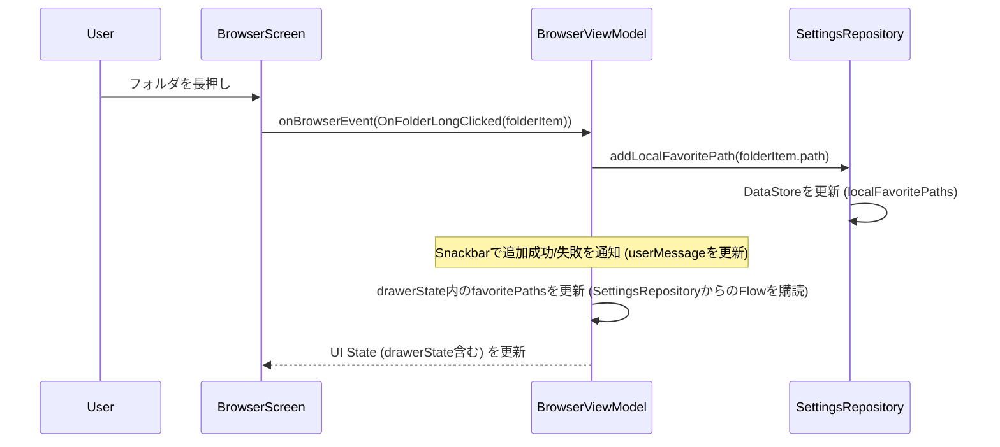
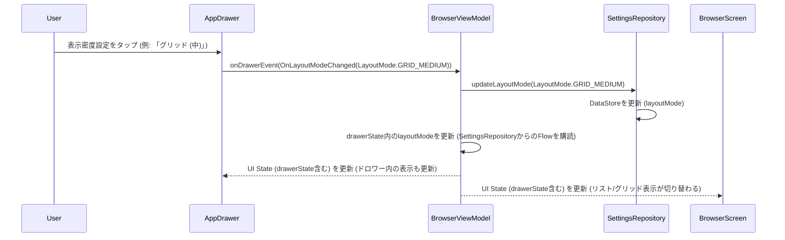

## 技術設計書: Modular Stream Player (Phase 2 - UI/UX向上とナビゲーション強化)

### 1. はじめに

このドキュメントは、「Modular Stream Player」開発プロジェクトのフェーズ2（UI/UX向上とナビゲーション強化）における技術設計を定義します。本ドキュメントは `Technical Design Document - Overview.md` および `Technical Design Document - Phase1.md` を基盤とし、フェーズ2で追加・変更された範囲に特化した詳細を記述します。

**フェーズ2のゴール**: ドロワーナビゲーション、パス管理機能を追加し、音楽プレーヤーとしての使い勝手を向上させる。

### 2. フェーズ2におけるアーキテクチャとモジュールの変更点

フェーズ1で構築された基盤の上に、主に以下の機能追加と変更が行われました。`Technical Design Document - Overview.md` で定義されたモジュール構造と依存関係のルールに従います。

*   **:feature-browser**:
    *   **ナビゲーションドロワー (`AppDrawer.kt`)**: 主要なナビゲーション（データソース切り替えのプレースホルダー、お気に入りパス、設定画面への導線）、UI設定（表示密度、画面モード）のUIを実装。
    *   **`BrowserViewModel.kt`**:
        *   ドロワーからのイベント処理 (`onDrawerEvent`) を追加。
        *   `SettingsRepository` を通じて、お気に入りパスの追加/削除、デフォルトパスの参照/設定（ローカルストレージに対して）、表示密度/画面モードの読み込み/更新を行うロジックを追加。
        *   UI状態 (`BrowserUiState`) にドロワーの状態 (`DrawerUiState`) を含めるように拡張。
    *   **`BrowserScreen.kt`**: 表示密度設定に応じて、リスト表示とグリッド表示（2列/3列）を切り替えるロジックを追加。
    *   **`MainScreen.kt`**: `ModalNavigationDrawer` を使用して全体のUI骨格を構成。`Scaffold` を使用し、トップバーとスナックバーホストを配置。
*   **:data-repository**:
    *   **`SettingsRepository.kt`**:
        *   ローカルストレージのデフォルトパス (`/storage/emulated/0/Music` など) の保存と取得。
        *   ローカルストレージのお気に入りパス (`Set<String>`) の保存と取得。
        *   リスト表示密度 (`LayoutMode`: LIST, GRID_MEDIUM, GRID_SMALL) の保存と取得。
        *   画面レイアウトモード (`ViewMode`: SINGLE, DUAL) の保存と取得。
        *   これらの設定値は `DataStore<Preferences>` を使用して永続化。
*   モジュール構成図自体に大きな構造的変更はありませんが、`:feature-browser` と `:data-repository` 内のクラスの役割と連携が深化しました。

### 3. 主要インターフェースとデータクラス定義 (フェーズ2追加・変更分)

#### 3.1. `:data-repository` (`SettingsRepository.kt` 関連)

```kotlin
// LayoutMode.kt (例: com.example.data_repository パッケージ内)
package com.example.data_repository

enum class LayoutMode {
    LIST,
    GRID_MEDIUM,
    GRID_SMALL
}

// ViewMode.kt (例: com.example.data_repository パッケージ内)
package com.example.data_repository

enum class ViewMode {
    SINGLE, // ブラウザまたはプレーヤーを全画面表示
    DUAL    // ブラウザとミニプレーヤーを同時に表示
}
```

```kotlin
// SettingsRepository.kt (拡張)
package com.example.data_repository

import androidx.datastore.core.DataStore
import androidx.datastore.preferences.core.Preferences
import androidx.datastore.preferences.core.edit
import androidx.datastore.preferences.core.stringPreferencesKey
import androidx.datastore.preferences.core.stringSetPreferencesKey
import kotlinx.coroutines.flow.Flow
import kotlinx.coroutines.flow.map
import javax.inject.Inject
import javax.inject.Singleton

@Singleton
class SettingsRepository @Inject constructor(
    private val dataStore: DataStore<Preferences>
) {
    private object PreferencesKeys {
        val LAYOUT_MODE = stringPreferencesKey("layout_mode")
        val VIEW_MODE = stringPreferencesKey("view_mode")
        val LOCAL_FAVORITE_PATHS = stringSetPreferencesKey("local_favorite_paths")
        val LOCAL_DEFAULT_PATH = stringPreferencesKey("local_default_path")
        // ACTIVE_DATA_SOURCE_TYPE, ACTIVE_SMB_CONNECTION_ID などもここで定義
    }

    val layoutMode: Flow<LayoutMode> = dataStore.data.map {
        LayoutMode.valueOf(it[PreferencesKeys.LAYOUT_MODE] ?: LayoutMode.LIST.name)
    }
    suspend fun updateLayoutMode(layoutMode: LayoutMode) {
        dataStore.edit { prefs -> prefs[PreferencesKeys.LAYOUT_MODE] = layoutMode.name }
    }

    val viewMode: Flow<ViewMode> = dataStore.data.map {
        ViewMode.valueOf(it[PreferencesKeys.VIEW_MODE] ?: ViewMode.SINGLE.name)
    }
    suspend fun updateViewMode(viewMode: ViewMode) {
        dataStore.edit { prefs -> prefs[PreferencesKeys.VIEW_MODE] = viewMode.name }
    }

    val localFavoritePaths: Flow<Set<String>> = dataStore.data.map {
        it[PreferencesKeys.LOCAL_FAVORITE_PATHS] ?: emptySet()
    }
    suspend fun addLocalFavoritePath(path: String) {
        dataStore.edit { prefs ->
            val currentFavorites = prefs[PreferencesKeys.LOCAL_FAVORITE_PATHS] ?: emptySet()
            prefs[PreferencesKeys.LOCAL_FAVORITE_PATHS] = currentFavorites + path
        }
    }
    suspend fun removeLocalFavoritePath(path: String) {
        dataStore.edit { prefs ->
            val currentFavorites = prefs[PreferencesKeys.LOCAL_FAVORITE_PATHS] ?: emptySet()
            prefs[PreferencesKeys.LOCAL_FAVORITE_PATHS] = currentFavorites - path
        }
    }

    val localDefaultPath: Flow<String> = dataStore.data.map {
        it[PreferencesKeys.LOCAL_DEFAULT_PATH] ?: "/storage/emulated/0/Music" // デフォルト値
    }
    suspend fun updateLocalDefaultPath(path: String) {
        dataStore.edit { prefs -> prefs[PreferencesKeys.LOCAL_DEFAULT_PATH] = path }
    }
    // (ActiveDataSource関連のFlowと更新メソッドも定義)
}
```

#### 3.2. `:feature-browser` (ViewModel と UI State)

```kotlin
// DrawerUiState.kt (例: com.example.feature_browser パッケージ内)
package com.example.feature_browser

import com.example.data_repository.LayoutMode
import com.example.data_repository.ViewMode

// フェーズ2時点ではデータソースはローカルのみを意識
sealed interface DataSourceItem {
    object Local : DataSourceItem { // シングルトンオブジェクトとして表現
        const val displayName = "ローカルストレージ"
    }
    // data class Smb(val connection: com.example.core_model.NasConnection) : DataSourceItem // フェーズ3で追加
}

data class DrawerUiState(
    val currentDataSource: DataSourceItem = DataSourceItem.Local,
    val availableDataSources: List<DataSourceItem> = listOf(DataSourceItem.Local),
    val favoritePaths: List<String> = emptyList(), // ローカルのお気に入りのみ
    val isFavoritesExpanded: Boolean = true,
    val layoutMode: LayoutMode = LayoutMode.LIST,
    val viewMode: ViewMode = ViewMode.SINGLE
)
```

```kotlin
// BrowserUiState.kt (拡張)
package com.example.feature_browser.browser

import com.example.core_model.FileItem
import com.example.feature_browser.DrawerUiState

data class BrowserUiState(
    val rootPath: String = "", // 現在のデータソースのルートパス
    val currentPath: String = "",
    val items: List<FileItem> = emptyList(),
    val isLoading: Boolean = true,
    val drawerState: DrawerUiState = DrawerUiState(), // Drawerの状態を追加
    val userMessage: String? = null // Snackbar表示用メッセージ
)
```

### 4. 主要機能のシーケンス設計 (フェーズ2追加・変更分)

#### 4.1. お気に入りパス追加シーケンス (ローカル)



#### 4.2. 表示密度変更シーケンス



### 5. 実装詳細と技術選定理由 (フェーズ2範囲)

#### 5.1. ナビゲーションドロワー (`:feature-browser`)

*   **`MainScreen.kt`**: `ModalNavigationDrawer` を使用し、ドロワーコンテンツとして `AppDrawer.kt` を指定。
*   **`AppDrawer.kt`**:
    *   `DrawerUiState` を受け取り、現在のデータソース（フェーズ2ではローカルのみ固定表示）、お気に入りパスリスト（ローカル）、UI設定（表示密度、画面モード）を表示・操作するUIをComposeで構築。
    *   お気に入りパスセクションは展開・折りたたみが可能。
    *   各設定項目が変更された場合、`BrowserViewModel` の対応するイベントハンドラ (`onDrawerEvent`) を呼び出す。
*   **状態管理**: ドロワー自体の開閉状態は `rememberDrawerState()` で管理。ドロワー内のコンテンツの状態は `BrowserViewModel` の `uiState.drawerState` から供給される。

#### 5.2. パス管理 (`:feature-browser`, `:data-repository`)

*   **お気に入りパス (ローカル)**:
    *   `SettingsRepository` がローカルのお気に入りパスを `Set<String>` として `DataStore` に保存 (`localFavoritePaths`)。
    *   `BrowserViewModel` は `SettingsRepository.localFavoritePaths` を購読し、`DrawerUiState` に反映。
    *   フォルダ長押しで `BrowserViewModel` が `SettingsRepository.addLocalFavoritePath()` を呼び出し、Snackbarで結果を通知。
    *   ドロワーでお気に入りパスをタップすると、`BrowserViewModel` がそのパスに移動 (`navigateToPath()` を呼び出し `currentPath` を更新)。
    *   ドロワーでお気に入りパスを長押しすると、削除確認後、`SettingsRepository.removeLocalFavoritePath()` を呼び出す。
*   **デフォルトパス (ローカル)**:
    *   ローカルストレージのデフォルトパスは、初期値を `/storage/emulated/0/Music` （または同等のパス）とし、`SettingsRepository` に `localDefaultPath` として保存。
    *   アプリ起動時やローカルデータソース選択時に、`BrowserViewModel` がこのデフォルトパスを初期表示パスとして使用する。
    *   将来的には「詳細設定」画面でユーザーが変更可能にする（フェーズ2ではUI未実装）。

#### 5.3. UI設定の永続化と適用 (`:feature-browser`, `:data-repository`)

*   **表示密度 (`LayoutMode`)**: `LIST`, `GRID_MEDIUM`, `GRID_SMALL` のいずれか。
*   **画面モード (`ViewMode`)**: `SINGLE` (全画面ブラウザ or 全画面プレーヤー), `DUAL` (ブラウザ + ミニプレーヤー)。
*   これらの設定は `SettingsRepository` に `Enum.name` (String型) として保存され、読み出し時に `Enum.valueOf()` で復元。`DataStore<Preferences>` を使用して永続化。
*   `BrowserViewModel` が `SettingsRepository` からこれらの設定値を購読し、`DrawerUiState` および `BrowserUiState` に反映。
*   **`BrowserScreen.kt`**: `uiState.drawerState.layoutMode` に応じて、`LazyColumn` (LIST) または `LazyVerticalGrid` (GRID_MEDIUM/SMALL) を動的に切り替えて表示する。
*   **`MainScreen.kt`**: `uiState.drawerState.viewMode` に応じて、`PlayerScreen` をミニプレーヤーとして表示するかどうかを制御する（DUALモード時のみ表示）。

