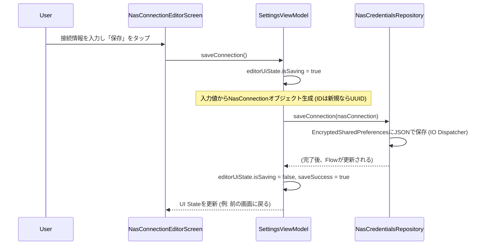
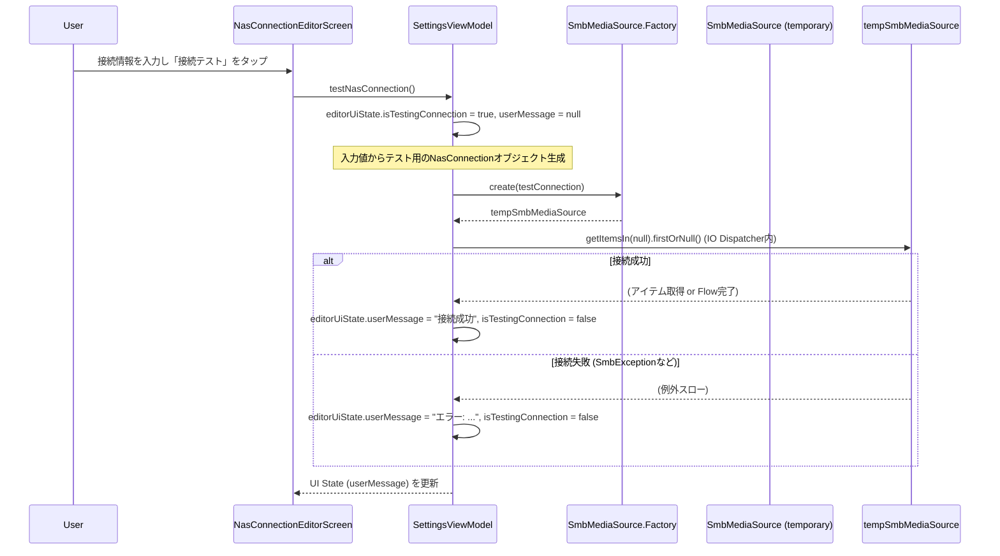

## 技術設計書: Modular Stream Player (Phase 3 - SMB対応)

### 1. はじめに

このドキュメントは、「Modular Stream Player」開発プロジェクトのフェーズ3（SMB対応）における技術設計を定義します。本ドキュメントは `Technical Design Document - Overview.md` およびフェーズ1、フェーズ2の技術設計書を基盤とし、フェーズ3で追加・変更された範囲に特化した詳細を記述します。

**フェーズ3のゴール**: メディアソースとしてNAS(SMB)を追加する。

### 2. フェーズ3におけるアーキテクチャとモジュールの変更点

フェーズ2で構築された基盤の上に、主にSMBプロトコルによるネットワーク上のメディアソースへの対応機能が追加されました。`Technical Design Document - Overview.md` で定義されたモジュール構造と依存関係のルールに従います。

*   **新規モジュール**:
    *   **:core-http**: `LocalHttpServer.kt` を実装。SMB上のファイルをHTTP経由でストリーミング再生可能にするためのローカルプロキシサーバー。JCIFS-NGに依存。
    *   **:data-smb**: `SmbMediaSource.kt` を実装。JCIFS-NGライブラリを利用してSMBサーバー上のファイル/フォルダにアクセスする。`:core-http` (LocalHttpServer) と `:core-model` (NasConnection) に依存。
*   **:data-repository**:
    *   **`NasCredentialsRepository.kt`**: NAS接続情報 (`NasConnection`) を`EncryptedSharedPreferences`で安全に永続化。CRUD操作とリストの`StateFlow`を提供。`kotlinx.serialization` を利用してJSON形式で保存。
    *   **`SettingsRepository.kt`**: アクティブデータソースとしてSMB接続を選択・保存できるように拡張 (`ActiveDataSource` シールドインターフェースと、SMB接続IDを保持する `ActiveDataSource.Smb` を導入)。
*   **:data-media-repository**:
    *   **`MediaRepository.kt`**: `SettingsRepository` から現在のアクティブデータソースを判別し、`LocalMediaSource` に加えて、HiltのAssisted Injectionで生成した `SmbMediaSource` に処理を委譲できるように拡張。`NasCredentialsRepository` と `SmbMediaSource.Factory` に依存。
    *   **`DataSourceModule.kt` (`:data-media-repository/di`)**: `SmbMediaSource.Factory` をDIコンテナに提供するよう更新。`LocalMediaSource` もQualifier付きで提供。
*   **:feature-browser**:
    *   **NAS接続設定UI**:
        *   `SettingsScreen.kt` 内に「NAS接続設定」の項目を追加し、`NasConnectionListScreen.kt` へナビゲート。
        *   `NasConnectionListScreen.kt`: 保存されたNAS接続情報の一覧表示（`SettingsViewModel` から `listUiState` を購読）、新規追加への導線、既存接続の編集/削除UI。長押しで削除確認ダイアログ表示。
        *   `NasConnectionEditorScreen.kt`: NAS接続情報の入力フォーム（ニックネーム、ホスト名、共有パス、ユーザー名、パスワード）、接続テスト機能。`SettingsViewModel` から `editorUiState` を購読。
    *   **`SettingsViewModel.kt`**: `NasCredentialsRepository` を利用したNAS接続情報のCRUD操作、`SmbMediaSource.Factory` を利用した接続テストロジックを実装。接続テストは `Dispatchers.IO` で実行し、結果を `editorUiState.userMessage` に反映。
    *   **`BrowserViewModel.kt`**:
        *   ドロワーの `availableDataSources` (`DrawerUiState`内) に保存済みNAS接続 (`DataSourceItem.Smb`) を表示。
        *   データソース切り替え時 (`onDrawerEvent(OnDataSourceSelected)`) に `SettingsRepository.updateActiveDataSource()` を呼び出し、選択されたデータソースのルートパスでファイルリストを再読み込み。
        *   SMBがアクティブな場合、`MediaRepository` 経由で `SmbMediaSource` が利用される。
        *   SMBアクセス時のエラー（`SmbAccessException` など）をキャッチし、`userMessage` を更新してSnackbarで表示。
    *   **`PlayerViewModel.kt`**:
        *   再生要求 (`PlaybackRequest`) に含まれる `dataSource` が `ActiveDataSource.Smb` の場合、`LocalHttpServer.getStreamingUrl()` を呼び出してSMBファイルのストリーミング用HTTP URLを取得し、`MediaController` に渡すように変更。`PlaybackService` はこのHTTP URLを直接再生する。
*   **DI**: Hiltの `@AssistedFactory` を用いて `SmbMediaSource.Factory` を作成し、`SmbMediaSource` インスタンス生成時に実行時引数 (`NasConnection`) を渡せるようにした。

### 3. 主要インターフェースとデータクラス定義 (フェーズ3追加・変更分)

#### 3.1. `:core-model`

```kotlin
// NasConnection.kt
package com.example.core_model

import android.os.Parcelable
import kotlinx.parcelize.Parcelize
import kotlinx.serialization.Serializable // kotlinx.serialization を使用

@Serializable // SharedPreferencesにJSONで保存するため
@Parcelize
data class NasConnection(
    val id: String, // UUIDなどで一意に
    val nickname: String, // UI表示用ニックネーム
    val hostname: String, // IPアドレスまたはホスト名
    val path: String,     // 共有名 + オプションのサブパス (例: "music" or "Multimedia/Audio")
    val username: String? = null,
    val password: String? = null
) : Parcelable
```

#### 3.2. `:data-repository`

```kotlin
// ActiveDataSource.kt (data-repositoryモジュールに配置)
package com.example.data_repository

import android.os.Parcelable
import kotlinx.parcelize.Parcelize

// シールドインターフェースでアクティブなデータソースの種類を表現
sealed interface ActiveDataSource : Parcelable {
    @Parcelize
    object Local : ActiveDataSource // ローカルストレージ

    @Parcelize
    data class Smb(val connectionId: String) : ActiveDataSource // SMB接続 (IDで管理)
}
```

```kotlin
// SettingsRepository.kt (抜粋 - ActiveDataSource関連)
package com.example.data_repository

// ... (他のimportやプロパティ) ...
import androidx.datastore.preferences.core.stringPreferencesKey
import kotlinx.coroutines.flow.Flow
import kotlinx.coroutines.flow.map

class SettingsRepository /* ... */ {
    private object PreferencesKeys {
        // ... (既存のキー) ...
        val ACTIVE_DATA_SOURCE_TYPE = stringPreferencesKey("active_data_source_type")
        val ACTIVE_SMB_CONNECTION_ID = stringPreferencesKey("active_smb_connection_id")
    }

    val activeDataSource: Flow<ActiveDataSource> = dataStore.data.map {
        val type = it[PreferencesKeys.ACTIVE_DATA_SOURCE_TYPE]
        val smbId = it[PreferencesKeys.ACTIVE_SMB_CONNECTION_ID]
        if (type == ActiveDataSource.Smb::class.java.simpleName && smbId != null) {
            ActiveDataSource.Smb(smbId)
        } else {
            ActiveDataSource.Local
        }
    }

    suspend fun updateActiveDataSource(dataSource: ActiveDataSource) {
        dataStore.edit {
            when (dataSource) {
                is ActiveDataSource.Local -> {
                    it[PreferencesKeys.ACTIVE_DATA_SOURCE_TYPE] = ActiveDataSource.Local::class.java.simpleName
                    it.remove(PreferencesKeys.ACTIVE_SMB_CONNECTION_ID) // SMB IDはクリア
                }
                is ActiveDataSource.Smb -> {
                    it[PreferencesKeys.ACTIVE_DATA_SOURCE_TYPE] = ActiveDataSource.Smb::class.java.simpleName
                    it[PreferencesKeys.ACTIVE_SMB_CONNECTION_ID] = dataSource.connectionId
                }
            }
        }
    }
    // ... (他のメソッド)
}
```

#### 3.3. `:data-smb` (`SmbMediaSource.kt`)

```kotlin
package com.example.data_smb

import com.example.core_model.FileItem
import com.example.core_model.FolderItem
import com.example.core_model.NasConnection
import com.example.core_model.TrackItem
import com.example.core_http.LocalHttpServer
import com.example.data_source.MediaSource
import dagger.assisted.Assisted
import dagger.assisted.AssistedFactory
import dagger.assisted.AssistedInject
import jcifs.CIFSContext
import jcifs.config.PropertyConfiguration
import jcifs.context.BaseContext
import jcifs.smb.NtlmPasswordAuthenticator
import jcifs.smb.SmbException
import jcifs.smb.SmbFile
import kotlinx.coroutines.Dispatchers
import kotlinx.coroutines.flow.Flow
import kotlinx.coroutines.flow.flow
import kotlinx.coroutines.flow.flowOn
import kotlinx.coroutines.withContext
import java.util.Properties
import android.media.MediaMetadataRetriever // メタデータ取得用
import kotlinx.coroutines.CancellationException

// カスタム例外クラス (SmbAccessException, SmbAuthenticationException, etc.)
// ...

class SmbMediaSource @AssistedInject constructor(
    private val localHttpServer: LocalHttpServer,
    @Assisted private val nasConnection: NasConnection
) : MediaSource {

    private val authContext: CIFSContext

    init {
        // JCIFS-NGの認証コンテキストを初期化 (nasConnectionの情報を使用)
        val properties = Properties().apply { /* SMBバージョン設定など */ }
        val config = PropertyConfiguration(properties)
        val baseContext = BaseContext(config)
        val auth = if (nasConnection.username.isNullOrEmpty()) null else {
            NtlmPasswordAuthenticator(null, nasConnection.username, nasConnection.password)
        }
        authContext = auth?.let { baseContext.withCredentials(it) } ?: baseContext
    }

    override fun getItemsIn(folderPath: String?): Flow<FileItem> = flow {
        val currentSmbPath = folderPath ?: buildSmbUrl(nasConnection.path)
        try {
            val file = SmbFile(currentSmbPath, authContext)
            if (!file.exists() || !file.isDirectory) return@flow

            // 親フォルダ ("..") アイテムの発行
            // ...
            // フォルダアイテムの発行
            file.listFiles().filter { it.isDirectory }.sortedBy { it.name.lowercase() }.forEach { emit(/* FolderItem */) }
            // トラックアイテム (プレースホルダ) の発行
            file.listFiles().filter { it.name.endsWith(".mp3", ignoreCase = true) }.sortedBy { it.name.lowercase() }.forEach { emit(/* TrackItem (placeholder) */) }

        } catch (e: SmbException) { /* Map to custom SmbAccessException subclasses */ }
          catch (e: CancellationException) { throw e }
          catch (e: Exception) { /* Map to generic SmbAccessException */ }
    }.flowOn(Dispatchers.IO)

    override suspend fun getTrackDetails(trackItem: TrackItem): TrackItem = withContext(Dispatchers.IO) {
        val smbFile = SmbFile(trackItem.path, authContext)
        return@withContext parseTrackMetadataUsingHttp(smbFile, trackItem)
    }

    private suspend fun parseTrackMetadataUsingHttp(smbFile: SmbFile, originalTrackItem: TrackItem): TrackItem {
        val retriever = MediaMetadataRetriever()
        try {
            localHttpServer.ensureStarted()
            val httpUrl = localHttpServer.getStreamingUrl(smbFile.canonicalPath, nasConnection.id)
            retriever.setDataSource(httpUrl, HashMap())
            // Extract metadata (title, artist, album, duration)
            // ... (extractedTitle, extractedArtist, etc.)
            return originalTrackItem.copy(
                title = extractedTitle ?: originalTrackItem.title,
                artist = extractedArtist,
                // ... (他のメタデータフィールド)
            )
        } catch (e: CancellationException) { throw e }
          catch (e: Exception) { /* Log error, return originalTrackItem or with partial data */ 
            return originalTrackItem
        } finally {
            retriever.release()
        }
    }

    private fun buildSmbUrl(sharePath: String): String { /* ... */ }

    @AssistedFactory
    interface Factory {
        fun create(nasConnection: NasConnection): SmbMediaSource
    }
}
```

#### 3.4. `:core-http` (`LocalHttpServer.kt`)

```kotlin
package com.example.core_http

import android.util.Log
import com.example.core_model.NasConnection
import com.example.data_repository.NasCredentialsRepository // 依存
import fi.iki.elonen.NanoHTTPD
import jcifs.config.PropertyConfiguration
import jcifs.context.BaseContext
import jcifs.smb.NtlmPasswordAuthenticator
import jcifs.smb.SmbFile
import java.io.IOException
import java.io.InputStream
import java.util.Properties
import javax.inject.Inject
import javax.inject.Singleton

@Singleton
class LocalHttpServer @Inject constructor(
    private val nasCredentialsRepository: NasCredentialsRepository
) : NanoHTTPD(DEFAULT_PORT) {

    companion object {
        const val DEFAULT_PORT = 8080
        private const val TAG = "LocalHttpServer"
        private const val STREAM_PREFIX = "/stream/"
    }

    init {
        // サーバー起動処理 (ensureStarted() に集約しても良い)
    }

    fun ensureStarted() {
        if (!isAlive()) {
            try {
                start(SOCKET_READ_TIMEOUT, false)
            } catch (e: IOException) { /* Log error */ }
        }
    }

    fun getStreamingUrl(smbPath: String, connectionId: String): String {
        ensureStarted()
        val encodedPath = smbPath.removePrefix("smb://")
        val currentPort = if (listeningPort > 0) listeningPort else DEFAULT_PORT
        return "http://127.0.0.1:$currentPort$STREAM_PREFIX$connectionId/$encodedPath"
    }

    override fun serve(session: IHTTPSession): Response {
        val uri = session.uri
        if (!uri.startsWith(STREAM_PREFIX)) {
            return newFixedLengthResponse(Response.Status.NOT_FOUND, MIME_PLAINTEXT, "Not Found")
        }
        try {
            val (connectionId, smbFullPath) = parseUri(uri)
            val connection = nasCredentialsRepository.getConnectionById(connectionId) 
                ?: return newFixedLengthResponse(Response.Status.NOT_FOUND, MIME_PLAINTEXT, "Connection info not found")
            
            val (inputStream, fileSize) = getSmbInputStream(smbFullPath, connection)
            return newFixedLengthResponse(Response.Status.OK, "audio/mpeg", inputStream, fileSize)

        } catch (e: IllegalArgumentException) { /* Bad Request */ 
            return newFixedLengthResponse(Response.Status.BAD_REQUEST, MIME_PLAINTEXT, "Bad Request: ${e.message}")
        } 
          catch (e: Exception) { /* Internal Server Error */ 
            return newFixedLengthResponse(Response.Status.INTERNAL_ERROR, MIME_PLAINTEXT, "Internal Error: ${e.message}")
        }
    }

    private fun parseUri(uri: String): Pair<String, String> {
        val pathPart = uri.substringAfter(STREAM_PREFIX)
        val connectionId = pathPart.substringBefore('/')
        val relativeSmbPath = pathPart.substringAfter('/')
        // ここで SmbMediaSource の buildSmbUrl のようなロジックでホスト名を付与してフルパスにするか、
        // SmbMediaSource から渡される時点でフルパスであることを期待するか、設計による。
        // 現状の getStreamingUrl の引数 smbPath がフルパスなので、それに合わせる。
        val smbFullPath = "smb://$relativeSmbPath" // Assuming relativeSmbPath is host/share/path
        return Pair(connectionId, smbFullPath)
    }

    private fun getSmbInputStream(smbPath: String, connection: NasConnection): Pair<InputStream, Long> {
        // JCIFS-NGを使用してSmbFileを開き、InputStreamとファイルサイズを取得
        val properties = Properties().apply { /* ... */ }
        val config = PropertyConfiguration(properties)
        val baseContext = BaseContext(config)
        val auth = if (connection.username.isNullOrEmpty()) null else {
            NtlmPasswordAuthenticator(null, connection.username, connection.password)
        }
        val authContext = auth?.let { baseContext.withCredentials(it) } ?: baseContext
        val smbFile = SmbFile(smbPath, authContext)
        return Pair(smbFile.inputStream, smbFile.length())
    }
}
```

### 4. 主要機能のシーケンス設計 (フェーズ3追加・変更分)

#### 4.1. NASファイルリスト表示シーケンス

(`Technical Design Document - Overview.md` の「5. データフローの基本パターン」および各モジュールの説明と重複するため、ここでは省略し、Overviewを参照)
1.  `BrowserViewModel` が `MediaRepository.getItemsIn(currentPath)` を呼び出す (現在の`activeDataSource`がSMBの場合)。
2.  `MediaRepository` は `activeDataSource` (Smb) と `connectionId` を元に `NasCredentialsRepository` から `NasConnection` を取得。
3.  `MediaRepository` は `SmbMediaSource.Factory` を使って `SmbMediaSource` インスタンスを生成 (LocalHttpServerとNasConnectionを渡す)。
4.  `SmbMediaSource.getItemsIn()` が呼び出され、JCIFS-NGでSMBサーバーからファイルリストを取得し `Flow<FileItem>` を返す。
5.  `BrowserViewModel` がFlowを収集しUIを更新。エラー発生時は `userMessage` を更新。

#### 4.2. NAS上の音楽再生開始シーケンス

1.  `User` が `BrowserScreen` でSMB上の `TrackItem` をタップ。
2.  `BrowserViewModel` が `PlaybackRequestRepository.requestPlayback()` を呼び出す。このとき `PlaybackRequest` には `ActiveDataSource.Smb(connectionId)` と対象 `TrackItem` (SMBパスを含む)、およびプレイリストが含まれる。
3.  `PlayerViewModel` が `playbackRequest` を購読し、リクエストを処理。
4.  `PlayerViewModel` は `request.dataSource` が `ActiveDataSource.Smb` であることを確認。
5.  `PlayerViewModel` が `localHttpServer.getStreamingUrl(trackItem.path, connectionId)` を呼び出してHTTP URLを取得。
6.  `PlayerViewModel` が `MediaController` を通じて `PlaybackService` に `MediaItem` (HTTP URLを含む) のリストと開始インデックスを設定し、再生を指示 (`setMediaItems`, `prepare`, `play`)。
7.  `PlaybackService` の `ExoPlayer` がHTTP URLを直接再生開始。
8.  `LocalHttpServer` が `ExoPlayer` からのリクエストを受け、対応するSMBファイルをストリーミング配信。

#### 4.3. NAS接続情報保存シーケンス



#### 4.4. NAS接続テストシーケンス



### 5. 実装詳細と技術選定理由 (フェーズ3範囲)

#### 5.1. NAS(SMB)アクセス (`:data-smb`)

*   **ライブラリ**: JCIFS-NG 2.1.7+ を利用 (SMBv2/v3対応のため)。
*   **認証**: `NtlmPasswordAuthenticator`。
*   **メタデータ取得**: `SmbMediaSource.getTrackDetails()`内で、`LocalHttpServer` を介してHTTP経由で `MediaMetadataRetriever` にデータソースを設定する。これは、`MediaMetadataRetriever` が `smb://` URI を直接サポートせず、また、SMBストリームを直接渡すのが複雑なため。
*   **エラーハンドリング**: `SmbException` をキャッチし、NTステータスコードに基づいて具体的なカスタム例外（`SmbAuthenticationException`など）に分類してスロー。
*   **DI**: `SmbMediaSource` は `@AssistedInject` を利用し、実行時に `NasConnection` を受け取る。`SmbMediaSource.Factory` をHiltで提供。

#### 5.2. `LocalHttpServer`によるSMBストリーミング (`:core-http`)

*   **目的**: `ExoPlayer` や `MediaMetadataRetriever` が `smb://` URIを直接扱えないため、SMB上のファイルをローカルHTTPサーバー経由でプロキシする。
*   **実装**: NanoHTTPD をベース。
*   **URL形式**: `http://127.0.0.1:{port}/stream/{connectionId}/{smbHostName}/{smbShareName}/{filePath}` (例)
    *   `connectionId` で認証情報を特定。
*   **起動とライフサイクル**: アプリケーション起動時 (`MainApplication.onCreate`) や、必要に応じて `LocalHttpServer` を利用する最初のコンポーネントから `ensureStarted()` を呼び出す。

#### 5.3. NAS接続情報の管理と永続化 (`:data-repository`, `:feature-browser`)

*   **`NasCredentialsRepository`**:
    *   `EncryptedSharedPreferences` を使用し、接続情報リストを `kotlinx.serialization` でJSON文字列に変換して暗号化保存。
*   **`SettingsViewModel`**: `NasCredentialsRepository` のCRUD操作をラップし、UIロジック（接続テストなど）を提供。

